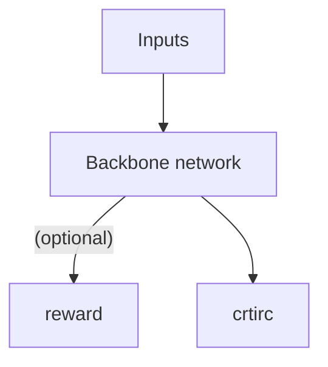

# PPO

## 1.完整链路
prompt batch -> actor.forward -> reward model -> critic.forward

## 2.算法实现方式：
1. 重要性采样：使用一次采样，进行多次更新，在尽可能高效率使用样本的前提下，尽可能的修正老策略与新策略的偏差
2. 裁剪(常用)，KL约束：现在新旧策略的偏移，防止梯度爆炸或者坍塌

### 1.公式
1. 概率比
$$r_t(\theta) = \frac{\pi_\theta(a_t|s_t)}{\pi_{\theta_{old}}(a_t|s_t)}$$

$\pi:策略$  
$\theta:参数$  
$a:动作$  
$s:状态$  
$t:时间$  

个人理解：新旧策略在同一状态下决策的相对差异

2. 裁剪目标

$$L^{CLIP}(\theta) =  \mathbb{E}_t[min(r_t(\theta)\hat{A}_t,clip(r_t(\theta),1-\epsilon,1+\epsilon)\hat{A}_t)]$$

$L:损失函数$
$\mathbb{E}_t:对时间步t时的重要性采样结果的期望$  
$\hat{A}_t:当前时间步的优势函数$  
$\epsilon:裁剪系数$

个人理解：用裁剪可以限制更新步长，既不要太大也不要太小，保证稳定性

3. 优势函数：

- GAE(广义优势估计,Generalized Advantage Estimation)

$$A^{GAE}(a_t,s_t) = \sum^{\infty}_{l=0}(\gamma\lambda)^l\delta_{t+l}$$

$$\delta_t = r_t+\gamma V(s_{t+1})-V(s_t)$$

$\gamma:折扣因子$  
$r:奖励值$  
$l:延迟的步数$  
$\lambda :控制TD的偏差与方差$  
$\lambda = 1:相当于蒙特卡洛回报,即保留了每一个时间步的TD$  
$\lambda = 0:相当于单步TD$  
$0<\lambda<1:保留了每一个时间步的TD，但是每一个TD有着不同的权重$ 

4. 值函数回归

$$L^{value} = \frac{1}{2}(V_{\theta}(s_t)-\hat{R}_t)^2$$

$V_{\theta}(s_t)$：t时状态为时的价值函数，由一个mlp拟合

5. 熵正则化(鼓励探索)
$$H(\pi_{\theta})=\mathbb{E_t}[-\sum_{\alpha}\pi_{\theta}(\alpha|s_t)log\pi_\theta(\alpha|s_t)]$$

注：说白了就是求信息熵取平均值

6. 总损失

$$L^{PPO} = L^{CLIP}(\theta)-c_1L_{value}+c_2H(\pi_{\theta})$$

## 2.流程详解

### 1.初始阶段
#### 1.prompt batch:
就是一批数据

#### 2.actor.forward:
- 使用主干网络对每一条数据生成回复，并逐步保存每一个token的logits作为$log\pi_{old}$

#### 3.reward 

- **model**

作用：用于打分获取奖励值，分数用于上述公式构造损失函数，将奖励值r存入bufferi以供后续训练使用  

构造：一个mlp

位置：接在骨干网络最后一层

优点：泛化能力强

缺点：需要大量有标注数据，可解释性差，稳定性差，计算需要资源多

- **function**

使用具体规则奖励，如编辑距离，重复度等

优点：计算简单迅速，可解释性强，稳定性强，

缺点：泛化能力差，仅在特定场景下有效

#### 4.critic.forward

作用：用于拟合骨干网络的价值函数，计算出优势函数，存入buffer，供后续训练使用

构造：一个mlp

位置：接在骨干网络左右一层

### 2.训练阶段 

使用buffer里面保存的数据反复训练模型，几轮后重新采样

### 3.网络结构

### 4.数据集构造

- reward function

```json
{
role: user,
content: <完整上下文/包含用于区分角色的特殊token>
}
solution: <模型回答正例或正例组>：用于reward function
```

# 特别注意

如果有内容错误或者解释不清楚，请联系本人进行修改。v:m1197501753
