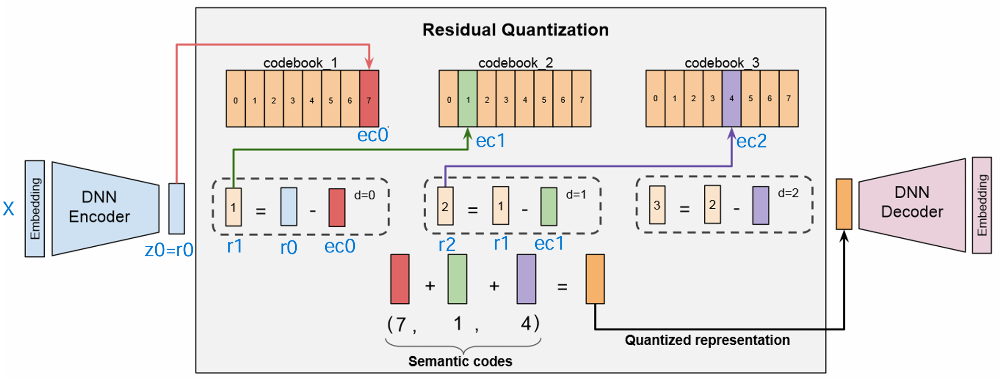

## RQ-VAE（残差量化变分自动编码器）

### 背景与提出动机

**VQ-VAE 的局限**：向量量化变分自编码器（VQ-VAE）在高保真生成任务中引入离散潜变量，通过码本（codebook）将连续潜向量离散化。然而，当我们希望缩短离散编码序列（例如将高分辨率图像表示为更少的代码）时，传统 VQ-VAE 面临率失真权衡的挑战。具体而言，若减少量化后特征图的空间尺寸（即更少的位置代码），则需要指数级扩大码本大小以维持重建质量。过大的码本不仅模型参数剧增，还容易出现码本崩溃问题。

**残差量化的引入**：为了解决上述问题，研究者提出了残差量化变分自动编码器（RQ-VAE）。其核心思想是用多级残差向量量化代替单次量化：在给定固定码本大小的前提下，递归量化编码器输出的残差，从粗到细逐步逼近原始表示。通过这种 Residual Quantization（残差量化，缩写RQ），无需扩充码本也能精确近似高维特征。换言之，RQ-VAE 通过组合多层码字极大扩展了表示能力：若每层码本大小为 _K_、层数为 _L_，则组合空间相当于一个大小为 $K^L$ 的超大码本，但参数量却远低于直接训练如此巨大码本。这种方式既保留了重建质量又缩短了代码序列长度，为高分辨率图像等数据的生成提供了新方案。

**应用背景**：RQ-VAE 的提出最初旨在改进自回归图像生成的效率和质量。在高分辨率图像自回归模型中，表示图像的离散代码序列过长会导致生成过程缓慢且计算成本高。RQ-VAE 可以在保持图像细节的同时显著减少代码序列长度（例如将256×256图像压缩为仅8×8=64个位置的代码）。这一点对于加速自回归 Transformer 的建模非常关键。此外，残差量化思想也在音频编码和推荐检索等领域兴起，将连续信号离散化为多层语义代码以便高效处理。总之，RQ-VAE 的动机在于克服单级量化的瓶颈，实现更高压缩率与重建质量兼顾的离散表示学习。

### 模型结构

#### 整体结构

RQ-VAE 延续了标准自编码器架构，由编码器、多级码本量化器和解码器三部分组成。

- 编码器将输入（如图像、音频片段或文本嵌入）映射到一个低维潜在表示 $z$。
- 然后，潜在向量经过多级残差量化模块处理，被表示为一系列码字索引（code indices）的组合。
- 解码器再根据这些离散码字重建出原始数据。

与传统 VAE 不同，RQ-VAE 的潜变量是离散且多层次的：每个输入对应多个码本索引，共同编码其信息。

#### 残差量化机制

在 RQ-VAE 中，潜在向量 $z$ 并非一次性用单个码字表示，而是通过递归残差量化逐级逼近。具体过程如下：

- 初始残差向量 $r_0$ 定义为编码器输出 $z$ 本身。
- 第一级量化时，模型在第0层码本 $C^0$ 中找到与 $r_0$ 最接近的码本向量 $v_{c_0}^0$，记录其索引 $c_0$ 作为第0级码字。然后计算残差 $r_1 = r_0 - v_{c_0}^0$，将未被码字解释的细节留存下来。
- 接着进入下一级：在第1层码本 $C^1$ 中找到最接近 $r_1$ 的向量 $v_{c_1}^1$，得到索引 $c_1$，并更新残差 $r_2 = r_1 - v_{c_1}^1$。
- 如此迭代，共进行 $L$ 级量化，得到码字索引序列 $(c_0, c_1, ..., c_{L-1})$。

最终的量化表征 $\tilde{z}$ 可表示为各级码本向量之和：$\tilde{z} = \sum_{d=0}^{L-1} v_{c_d}^d$，它近似地重构了原始潜在向量 $z$。解码器以 $\tilde{z}$ 为输入重新生成数据 $\hat{x}$，尽量逼近原始输入 $x$。

#### 多层码本设计

RQ-VAE 通常为每一量化级别配备一个独立的码本 $C^d$（大小为 $K$），而非使用单一巨大码本。这种层级码本设计的原因在于：随着量化深入，残差向量范数往往递减，每一层需要表示的细节信息规模不同。为此，各层码本可以针对不同尺度的信息进行不同粒度的量化。第一层码字通常捕获了输入最粗略、最主要的特征模式，后续层的码字逐步添加更精细的细节修正。这种逐层精炼使得 RQ-VAE 的离散表示本身带有语义分层结构：例如在推荐系统中，相似物品可能共享部分语义ID（码字序列的前缀），表示它们在高层语义上相近。值得注意的是，也有研究采用共享码本的策略，在所有层复用同一套码字向量。共享码本可以减少参数量并提高码字利用率——有实验观察到不同层之间存在大量码字复用现象。无论采用独立还是共享码本，RQ-VAE 都实现了一个层次离散表示：每个输入通过码字组合来表示，既包含总体语义又涵盖细节信息。

#### 编码器/解码器结构

编码器和解码器的具体网络结构可根据任务调整。例如在图像RQ-VAE中，编码器通常是卷积神经网络，将高维图像压缩成低分辨率的特征图，再铺平成一系列潜在向量供量化。解码器则是对称的卷积网络，将量化后的特征重建回图像。在音频或语言等一维序列任务中，编码器/解码器可以采用卷积堆栈或Transformer等结构，将输入信号转为潜在向量并复原。需要强调的是，RQ-VAE 的编码器-解码器与标准 VQ-VAE 相同点在于重建目标，不同点在于潜在代码表示的形式发生了变化——由单码字扩展为多码字组合。这一架构设计令 RQ-VAE 有能力在不牺牲太多重建质量的情况下，大幅提高压缩率和表示灵活性。

### 损失函数

RQ-VAE 的训练目标延续了 VQ-VAE 的基本思想，即在**重建误差**和**量化码本优化**之间取得平衡。总损失通常包含两部分：

#### **重建损失**

鼓励解码器输出 $\hat{x}$ 与原始输入 $x$ 尽可能接近。常用度量是重建误差的均方误差或感知损失等。对于图像等数据通常采用像素级 MSE 或感知特征误差，以确保多码字组合后仍能高质量重构输入。

#### 码本向量损失

这是针对量化层的特殊设计，用于学习和维持码本的有效性。典型做法是在量化过程中对编码器输出（或残差）和对应码本向量之间的差距施加约束。具体实现上，VQ-VAE 引入了“停止梯度”技术，将编码器输出视为目标常量，仅更新码本向量以最小化它们与编码器输出之间的距离。同时，添加一项“承诺损失”使编码器输出靠近选中的码本向量，避免编码器持续输出过大的残差不加收敛。在 RQ-VAE 的多级情境下，这类损失会对每一级量化都计算一次，鼓励各层码本向量能够贴近其负责逼近的残差信号。以第 $d$ 层为例，可对选中码字 $v_{c_d}^d$ 和对应残差 $r_d$ 施加 $| \text{sg}(r_d) - v_{c_d}^d |_2^2$ 的损失（sg表示停止梯度，仅优化码本），同时加上 $\beta | r_d - \text{sg}(v*{c_d}^d)|_2^2$ 约束编码器行为。各层损失求和后与重建损失加权合并，即构成完整训练目标。通过调整超参数权重 $\beta$ 等，可以平衡重建精度和码本学习稳定性。

### 模型训练

#### 联合训练

RQ-VAE 的编码器、解码器和多个码本通常采用端到端联合训练。每次迭代通过前向传播获得多级码字及重建结果，计算上述综合损失，再通过反向传播更新参数。由于量化操作本身不可导，通常使用**直通估计器**（straight-through estimator）对量化选取的码字传递梯度——将梯度直接传给对应的编码器输出，从而允许网络更新。码本向量则通过“停止梯度”技巧只根据码本损失更新，不干扰编码器输出梯度。实践中，这一联合训练过程需精心权衡各部分损失的系数，以防止重建误差压制码本更新或反之，导致模型陷入不收敛或码字未被充分利用。

#### 码本初始化与稳定性

为了缓解码本崩溃（大量输入映射到极少数码字）等训练不稳定现象，经验上常采用一些策略：

**良好初始化码本**：例如对第一批训练数据进行 k-means 聚类，将聚类中心设置为初始码本向量。这样做可以提供一个较为分散、多样的初始码字分布，减少模型一开始陷入局部最优的风险。

**正则化与更新频率控制**：比如对很少被使用的码字添加微小扰动或周期性重新初始化未使用码字，以鼓励探索。

**分层训练**：如果码本层数较多，可考虑先训练少层的模型取得稳定重建，再逐步增加量化层数。

值得一提的是，Lee等人在提出 RQ-VAE 时观察到采用**共享码本**有助于提高码字利用率。共享码本意味着各层使用同一组向量，不存在某层码本闲置的情况，从而缓解了低频码字浪费的问题。不过，共享码本也可能降低每层针对不同残差范围优化的灵活性。总的来说，RQ-VAE 的训练在继承 VQ-VAE 经验的基础上，需要针对多级量化的特性作适当调整，以确保每一级码字都能有效学习并协同完成高质量重建。

### 模型优势与缺陷

**优势**：

- **高效的离散表示**：RQ-VAE 能以较少的序列长度表示数据，同时保持细节信息。相比单码字方案，需要的码字总数大幅减少，方便下游自回归或序列建模。例如在图像任务中，RQ-VAE 可将256×256图像表示为8×8=64个位置，每个位置由多码字组合表示，极大降低了自回归模型的计算开销。
- **高保真的重建质量**：通过残差递进量化，RQ-VAE 在固定码本容量下达到了比VQ-VAE更强的表示能力。实验表明，增加量化深度比扩大码本对提高重建质量更有效。RQ-VAE 可在比 VQ-VAE 更低的特征图分辨率下仍保持重建逼真，解决了单级量化降低分辨率即引发失真的难题。
- **稳定的码本利用**：由于信息被分散到多层码字，单个码字无需承载所有信息，这在一定程度上减轻了码本塌陷的倾向。特别是共享码本策略下，不同量化层复用同一套码字，使得码字利用率更高，很多码字可以在粗层和细层均发挥作用。整体来看，RQ-VAE 的多级量化避免了出现“大部分码字闲置、少数码字过载”的极端情况。
- **语义分层与组合灵活性**：RQ-VAE 的多码字组合形式天然形成层次化语义。第一层码字往往对应类别或粗略属性，后续码字添加细节（例如风格、纹理等），这种可解释性在某些应用中十分有益。同时，多码字离散表示也为组合泛化提供了可能——不同数据可能共享部分码字，从而在离散空间中体现相似度关系。

**缺陷**：

- **自回归模型的局限**：RQ-VAE 常与自回归Transformer结合用于生成任务。虽然其在大数据集上效果突出，但在小规模数据上模型易过拟合，未能超越最先进的GAN（例如 StyleGAN2）。这是自回归范式的通病：在有限数据下难以学到像GAN那样的泛化表示。因此在小数据集上，RQ-VAE 并未解决自回归模型过拟合的问题，需要引入正则化或更强的先验。
- **单向生成与速度**：自回归生成只能单向地逐步解码，相较扩散模型等可以并行采样的方法，其推理速度依然较慢。不过，RQ-VAE 减少序列长度在一定程度上加快了采样，但本质上仍需逐步生成序列。对于需要双向上下文（如图像编辑）的任务，自回归 + RQ-VAE 框架仍显局限。未来或需结合双向模型或其他生成范式来克服这一点。
- **训练复杂度**：多级量化带来了更多的训练超参数（如量化层数、各层码本大小、损失权重等）。训练RQ-VAE往往比训练单级VQ-VAE更为复杂且耗时——每新增一层码本都会增加编码器计算和损失项，训练不当可能导致某些码字长期未被使用或重建质量下降。例如，研究者发现需要增加训练轮数才能充分发挥深层RQ-VAE的潜力，但这又提高了训练成本。因此，如何高效训练深层次的RQ-VAE成为一大挑战。
- **模型参数与内存**：虽然RQ-VAE避免了单个超大码本，但如果采用独立码本方案且层数较多，整体参数量和存储开销也不可忽视。例如每层有K个码字、每个D维，如果L层独立码本则参数约为 $L \times K \times D$。当 L 很大时（如音频模型中可能几十层）、或 D 很高维时，总参数量仍然可观。不过在常用设置下（例如图像模型几层、每层码本几千维），这点开销通常在可接受范围。此外，多码字在推理时需要叠加求和，也略增加了解码计算量，但相对总计算而言影响不大。

综上，RQ-VAE 提供了优越的离散表示能力，但在特定方面仍存在改进空间，包括更快的生成、更稳健的训练以及结合其它生成架构等。

### 应用场景

RQ-VAE 作为离散表示学习的强大工具，被成功应用于多种模态的生成和建模任务，并取得优异表现：

- **图像生成**：RQ-VAE 最初应用于高分辨率图像的生成。Lee等人提出将 RQ-VAE 编码的离散码作为 Transformer 的输入，构建两阶段模型（RQ-VAE + 自回归Transformer）用于图像生成。在ImageNet等数据集上，该方法在无条件和有条件生成任务中均超越了以往的自回归模型性能。尤其值得关注的是，在256×256图像上，RQ-VAE 将特征图缩减为8×8，提高了Transformer建模的效率，却仍能生成高质量图像，FID等指标显著改善。同时，相较于之前的像素CNN等逐像素AR模型，该框架的采样速度提高了数量级。不过在小规模数据集（如FFHQ人脸）上，其效果仍逊于当时最好的GAN模型。总体而言，RQ-VAE + Transformer 在图像生成方向证明了短码表示+自回归的可行性，为后来者提供了新思路。
- **音频建模**：在神经音频编码和生成领域，残差向量量化已经成为标配技术之一。Google 提出的 SoundStream 模型将语音/音频信号经过卷积编码器并应用多层残差量化（高达数十层），实现了对宽带音频的有损压缩。SoundStream 在保持接近原始音质的同时，将比特率降至数 kbps 级别，其关键就在于多级码本提供了高精度的重建能力。这些离散音频码随后可用于音频生成模型：例如 Google 的 AudioLM、MusicLM 等方法先用SoundStream获取离散音频表示，再训练语言模型生成这些离散码，从而产生连贯的音乐或讲话。Facebook 的 EnCodec 也是类似思想的音频编码器。可以说，RQ-VAE（或称RVQ）的思路使得神经网络能学习端到端压缩音频，同时为后续的生成任务提供离散单位。因此在音频去噪、音乐生成、语音传输等方向，基于残差量化的VAE模型都表现出高保真、高压缩的优越性能。
- **语言与推荐**：虽然文本天然是离散符号序列，但在语义表示方面，RQ-VAE 也开始发挥作用。例如在生成式推荐系统中，RQ-VAE 被用来将物品的内容特征（如商品描述文本）编码为语义ID。每个物品被表示为一组码字（语义ID元组），相似的物品会共享部分码字，从而在离散空间中保持语义上的邻近。像 Google 提出的 TIGER和国内快手的 OneSug 模型都使用 RQ-VAE 对文本描述或查询进行离散化，把用户历史序列映射成语义代码，再用序列到序列模型生成下一个推荐物品或查询。这些语义ID有效缓解了推荐场景中使用原始ID导致词表过大的问题，使得大语言模型也能直接处理物品序列。在语言建模方面，也有研究尝试将句子的连续语义表示离散化，以利于压缩和检索。例如生成式搜索（Generative Retrieval）任务中，RQ-VAE 提取查询的语义ID，再通过逐字解码生成最相关的文档ID。这些尝试表明，RQ-VAE 在语言相关领域可以作为语义嵌入离散化工具，提高跨模态或跨系统的对接效率。在多模态应用中，人们也设想将图像、音频通过各自的RQ-VAE离散化，和文本一起统一表示为离散序列，从而让一个通用Transformer同时理解多种信号。总之，在语言与推荐系统方向，RQ-VAE 提供了一种将高维语义向量转为可组合离散符号的方法，已展现出提升下游任务性能的潜力。

### 与VQ- VAE对比

#### VQ-VAE：

经典 VQ-VAE使用单一级码本将连续潜在向量量化为一个离散码字，从而得到图像或序列的离散表示。它的优点是结构简单，离散码直接可用于训练自回归模型。然而，由于每个位置只有一个码字，VQ-VAE 为了表示足够细节常需要较高的空间分辨率或庞大的码本。如前所述，单码本方案在压缩比和保真度间存在权衡：若减少码字数目（降分辨率），必须增大码本大小来避免信息缺失。过大的码本又引发稳定性问题（如码本向量用不充分）。相比之下，RQ-VAE 利用多码字组合显著扩展了表达能力，无需极端依赖码本规模。在相同码本大小下，RQ-VAE 可以用更少的空间位置表示数据，同时保持高保真重建。可以说，RQ-VAE 在码本大小一定时突破了 VQ-VAE 在表示容量上的局限，是对 VQ-VAE 的扩展。

#### VQ-VAE-2

VQ-VAE-2 是对 VQ-VAE 的层次拓展，由 DeepMind 提出，用于更好地生成图像细节。它引入了两级（或多级）离散层次：例如高层码字捕获全局粗略结构，低层码字捕获局部精细信息。具体实现上，VQ-VAE-2 有两个（或多层）独立的VQ模块：先编码得到高层离散表示，再在解码时将高层表示作为条件去预测细粒度的低层离散表示。这与 RQ-VAE 的区别在于：VQ-VAE-2 的层次是在空间/语义上分离的，每层码字各自对应不同尺度的特征图；RQ-VAE 的层次是在同一潜在向量上的递进近似，多层码字共同构成一个位置的表示。直观地讲，VQ-VAE-2 好比“先概括后细化”地编码图像，不同层码字作用在不同抽象级别；RQ-VAE 则是在同一抽象级别通过残差叠加来细化编码。两者都体现了分层离散表示思想，但实现机制有所不同。VQ-VAE-2 能提高生成质量（特别是纹理细节）并提供多尺度语义控制，但它并未显著减少总的代码数量，反而因为引入多个层次可能需要更多码字参与重建。相反，RQ-VAE 的设计初衷之一就是减少离散序列长度，它把信息浓缩进较少的位置，通过每个位置的多码字叠加来确保细节不丢失。因此，在需要紧凑离散表示的场景下（如自回归建模需短序列），RQ-VAE 相对更有优势。

### 总结

RQ-VAE 将残差量化与变分自编码器思想相结合，成功实现了高压缩比且保真度高的离散表示学习。它通过多级码本的粗到细量化，克服了传统 VQ-VAE 在码本容量和序列长度上的两难困境，实现了离散潜代码的层次表示。这种方法在图像、音频、文本等多领域的应用中取得了显著成果，不仅提高了生成模型的效果和效率，也为跨模态表示、生成式检索等新兴任务提供了有力工具。
