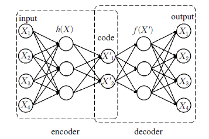
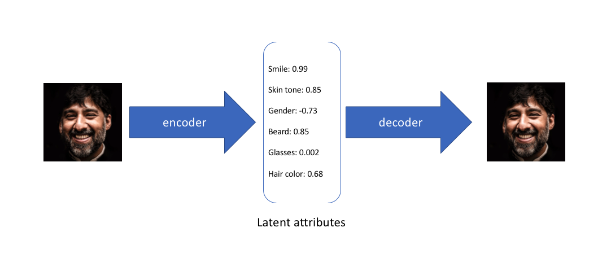
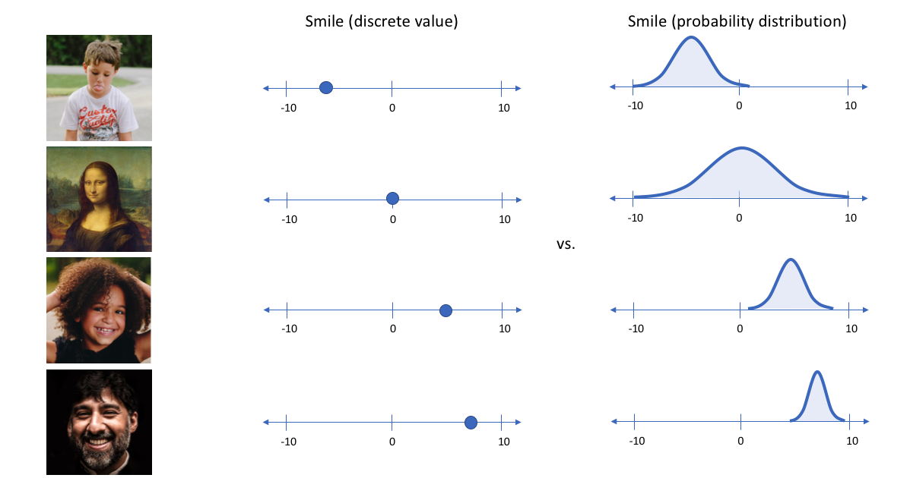
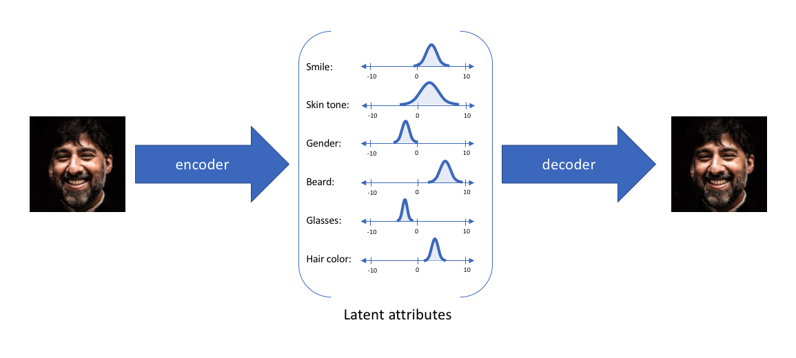
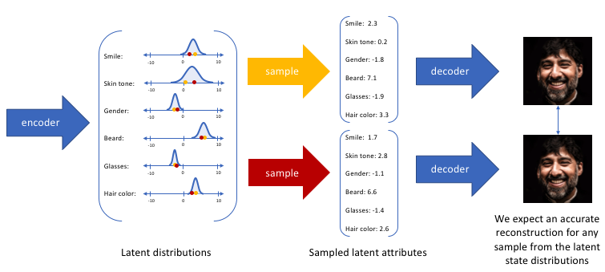
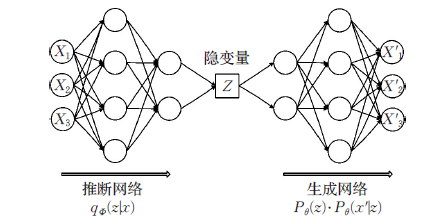

## VAE（变分自编码器）

### 概述

变分自编码器（Variational Autoencoder，缩写为 VAE）是2013年由 Kingma 和 Welling 提出的深度生成模型。在此之前，传统自编码器（AE）主要用于学习数据的低维表示，其编码器-解码器结构可以重构输入，但由于编码得到的是确定的固定向量，无法直接用于生成全新的样本。也就是说，普通自编码器缺乏对潜在空间分布的约束，无法确保从潜在空间随机采样的点仍能解码出合理的数据。这限制了自编码器作为生成模型的能力。

普通自编码器（AE）只关心把输入压缩再还原得准不准，不会强制不同样本的潜表示在空间中形成某种整体分布。比如模型有可能将同类图片的$z$散得很远；而不同类别的$z$可能混在一起，也就是潜空间的邻近点没有在对应语义上相似。同时缺乏连续性，也就是潜空间可能有“空洞”。

VAE 的动机正是为了解决上述问题，将自编码器与概率图模型相结合，引入变分推断来学习数据的潜在分布，从而实现对数据的生成建模。通过在编码器输出施加分布约束（例如假定潜在变量服从标准正态分布），VAE 将自编码器转变为真正的生成模型，使我们可以通过采样潜在变量来生成新数据。这一关键改进使 VAE 可以在避免过拟合的同时学习潜在空间的分布，从而既能够准确重构原始输入，又能够生成与训练数据相似的新样本。

### 基本原理

传统的自编码器模型主要由两部分构成：编码器（encoder）和解码器（decoder）。如下图所示：

在上面的模型中，经过反复训练，我们的输入数据X最终被转化为一个编码向量X’， 其中X’的每个维度表示一些学到的关于数据的特征，而X’在每个维度上的取值代表X在该特征上的表现。随后，解码器网络接收X’的这些值并尝试重构原始输入。

**举例子：**

假设任何人像图片都可以由表情、肤色、性别、发型等几个特征的取值来唯一确定，那么我们将一张人像图片输入自动编码器后将会得到这张图片在表情、肤色等特征上的取值的向量X’，而后解码器将会根据这些特征的取值重构出原始输入的这张人像图片。

在上面的示例中，我们使用单个值来描述输入图像在潜在特征上的表现。但在实际情况中，我们可能更多时候倾向于将每个潜在特征表示为可能值的范围。例如，如果输入蒙娜丽莎的照片，将微笑特征设定为特定的单值（相当于断定蒙娜丽莎笑了或者没笑）显然不如将微笑特征设定为某个取值范围（例如将微笑特征设定为x到y范围内的某个数，这个范围内既有数值可以表示蒙娜丽莎笑了又有数值可以表示蒙娜丽莎没笑）更合适。而变分自编码器便是用“取值的概率分布”代替原先的单值来描述对特征的观察的模型，如下图的右边部分所示，经过变分自编码器的编码，每张图片的微笑特征不再是自编码器中的单值而是一个概率分布。

通过这种方法，我们现在将给定输入的每个潜在特征表示为概率分布。当从潜在状态解码时，我们将从每个潜在状态分布中随机采样，生成一个向量作为解码器模型的输入。

通过上述的编解码过程，我们实质上实施了连续，平滑的潜在空间表示。对于潜在分布的所有采样，我们期望我们的解码器模型能够准确重构输入。因此，在潜在空间中彼此相邻的值重构出来的原始输入也应该很相似。

以上便是变分自编码器构造所依据的原理，我们再来看一看它的具体结构。

如上图所示，VAE利用两个神经网络建立两个概率密度分布模型：

- 一个用于原始输入数据的变分推断，生成隐变量的变分概率分布，称为**推断网络**
- 另一个根据生成的隐变量变分概率分布，还原生成原始数据的近似概率分布，称为**生成网络**

### 模型结构

VAE 的模型结构包含编码器（Encoder）、解码器（Decoder）和隐变量（潜在变量）三个核心部分，它们各司其职，协同实现数据重构与生成。VAE 的编码器网络将输入数据 $x$ 提取为潜在空间中的概率分布参数（而非单一确定编码），然后从该分布中采样得到隐变量 $z$，再由解码器根据 $z$ 生成输出 $x'$。

#### 编码器（Encoder）

在 VAE 中，编码器不再输出一个固定的隐表示，而是输出潜在分布的参数（通常是高斯分布的均值和对数方差）。编码器网络记作 $q_{\phi}(z|x)$，由参数 $\phi$ 控制，用于近似后验分布。它接收观测数据 $x$，提取其主要特征并映射到潜在空间，产生隐变量的概率分布（如 $\mu(x)$ 和 $\sigma(x)$）。编码器的角色相当于“推断网络”，在给定数据时预测出隐变量的分布。这种设计使得隐变量具有不确定性，从而提升了模型的泛化能力。

#### 隐变量（Latent Variable）

 $z$：隐变量位于潜在空间，代表数据生成的潜在因素。与传统自编码器的确定性编码不同，VAE 将隐变量视为随机变量。通常我们假设隐变量遵循一个简单的先验分布 $p(z)$（例如维度为 $d$ 的标准正态分布 $\mathcal{N}(0,1)$），这样编码器学习得到的是使后验接近先验的分布参数。引入随机隐变量使模型成为概率生成模型的一部分：不同的 $z$ 值对应于数据空间中的不同生成结果。隐变量的概率表示确保了潜在空间的连续性和结构性，从而支持从潜在空间采样生成新数据.

#### 解码器（Decoder）

解码器接收隐变量 $z$（采样值）作为输入，生成与原数据空间同分布的输出 $x'$。解码器定义了似然分布 $p_{\theta}(x|z)$，由参数 $\theta$ 控制，通常也是通过神经网络实现。解码器的作用类似于“生成网络”，它学习从潜在空间映射回数据空间，尝试重构原始输入或生成与训练样本分布一致的样本。直观来说，解码器就是根据 $z$ 来“想象”对应的输入会是什么样，从而实现数据的生成过程。

在训练阶段，编码器和解码器通过共享的隐变量 $z$ 串联形成自动编码器结构，只是中间的表示变为了概率分布。编码器保证 $z$ 含有足够的关于 $x$ 的信息以重构输入，解码器则尝试根据 $z$ 精确地还原 $x$。由于我们强制隐变量的分布接近于预设的先验（如标准正态），任何从先验中采样的 $z$ 都有可能通过解码器生成合理的样本。这一点正是 VAE 区别于普通自编码器的关键：编码器输出的是一个连续的概率分布而非固定编码。这样，当我们需要生成新数据时，可以直接从先验分布采样 $z$ 然后输入解码器，解码器会产生产生的样本。因此，VAE 实现了对数据分布的显式建模，成为一个真正的生成模型。

### 概率图建模与生成过程

VAE 可以被视为一种带隐变量的概率图模型。从概率图的角度，VAE 定义了观测数据 $x$ 和隐变量 $z$ 之间的关系：隐变量 $z$ 通过生成分布 $p_{\theta}(x|z)$ 产生观察数据 $x$。也就是说，我们假定存在一个隐藏的随机变量 $z$ 生成了数据 $x$，其过程为：首先从先验分布 $p(z)$ 中采样一个潜在向量 $z$，然后根据 $p_{\theta}(x|z)$ 来生成观测样本 $x$。用图模型表示，就是一个简单的有向图：$z \rightarrow x$。这个生成过程可以形式化为：

- **先验分布**：$z \sim p(z)$，通常 $p(z) = \mathcal{N}(0, I)$，表示我们对隐变量的先验假设是各维独立的标准高斯分布。选择正态分布作为先验，一方面是因为高斯分布易于处理（例如KL散度有解析解），另一方面根据概率生成模型理论，足够复杂的函数映射可以将简单分布的随机变量变换为任意复杂分布。
- **条件生成分布**：$x \sim p_{\theta}(x|z)$，它刻画了给定潜在变量 $z$ 时生成观测数据 $x$ 的概率分布。通常我们根据数据类型选取适当的分布形式并由解码器网络参数化。例如，对于像素为0/1的二值图像，$p_{\theta}(x|z)$可假设为每个像素独立的Bernoulli 分布；对于连续图像，可假设为高斯分布（解码器输出像素强度的均值和方差）。解码器网络根据输入的隐变量 $z$ 输出分布的参数，从而确定 $x$ 的生成概率。直观来说，$p_{\theta}(x|z)$ 给出了“由 $z$ 生成 $x$”的机制。

综上，VAE 定义了一个参数化的联合分布 $p_{\theta}(x, z) = p(z),p_{\theta}(x|z)$。生成过程就是按上述顺序从该联合分布采样得到 $(z, x)$ 对，从而得到新的数据点 $x$。VAE 的目标是在参数 $\theta$ 上最大化观测数据的边缘似然 $p_{\theta}(x)$。根据模型定义，观测数据的边缘概率为：
$$
p_\theta (x) = \int p_\theta (x,z)\ dz = \int p_\theta (x|z)p(z)\ dz
$$
即对所有可能的 $z$ 取积分（或求和）。这个积分高维情况下往往无法解析求解。因此，需要借助近似推断的方法来优化模型参数。这引出了 VAE 中最核心的思想——**变分推断**及**证据下界（ELBO）**的构建。

### 变分推断与变分下界（ELBO）

由于边缘似然 $p_{\theta}(x)$ 难以直接计算和最大化，我们转而采用变分推断(Variational Inference) 来近似计算后验分布，并构造边缘似然的下界来优化模型。具体来说，对于给定的数据点 $x$，我们希望估计后验分布$p_{\theta}(z|x)$（隐变量在给定观测下的分布），以便知道哪些潜在变量 $z$ 更有可能生成 $x$。但直接求 $p_{\theta}(z|x) = \frac{p_{\theta}(x,z)}{p_{\theta}(x)}$ 同样涉及不可解的 $p_{\theta}(x)$。

VAE 的巧妙之处在于，引入了一个由编码器定义的近似后验分布 $q_{\phi}(z|x)$，并通过最小化 $q_{\phi}(z|x)$ 与真实后验 $p_{\theta}(z|x)$ 之间的差异，间接地最大化了对数似然。我们选择用 $q_{\phi}(z|x)$ 去近似 $p_{\theta}(z|x)$，将求解后验难题转化为优化问题：让 $q_{\phi}(z|x)$ 尽可能贴近真实后验。

为度量两个分布的差异，我们采用Kullback-Leibler 散度（KL散度）。对于任意分布 $q(z)$ 和 $p(z)$，KL散度定义为 $D_{\mathrm{KL}}(q|p) = \mathbb{E}_{q}[\log \frac{q(z)}{p(z)}]$。KL散度非负，且只有当 $q=p$ 时为0。我们利用KL散度来连接 $q_{\phi}(z|x)$ 与我们要求的量。例如，对真实后验和近似后验应用KL散度：
$$
D_{\mathrm{KL}}\left( q_{\phi}(z \mid x) \,\|\, p_{\theta}(z \mid x) \right) 
= \mathbb{E}_{q_{\phi}(z \mid x)} \left[ \log \frac{q_{\phi}(z \mid x)}{p_{\theta}(z \mid x)} \right] \geq 0
$$
经过推导（应用贝叶斯公式并整理），可以得到下式：
$$
\log p_{\theta}(x) = \mathbb{E}_{q_{\phi}(z \mid x)} \left[ \log p_{\theta}(x \mid z) \right] 
- D_{\mathrm{KL}}\left( q_{\phi}(z \mid x) \,\|\, p(z) \right) 
+ D_{\mathrm{KL}}\left( q_{\phi}(z \mid x) \,\|\, p_{\theta}(z \mid x) \right)
$$
将上述等式变形可知：
$$
\log p_{\theta}(x) 
- D_{\mathrm{KL}}\left( q_{\phi}(z \mid x) \,\|\, p_{\theta}(z \mid x) \right) 
= \mathbb{E}_{q_{\phi}(z \mid x)} \left[ \log p_{\theta}(x \mid z) \right] 
- D_{\mathrm{KL}}\left( q_{\phi}(z \mid x) \,\|\, p(z) \right)
$$
由于最后一项KL散度恒为非负，将其移至左侧得到：
$$
\log p_{\theta}(x) \ge \mathbb{E}_{q_{\phi}(z \mid x)} \left[ \log p_{\theta}(x \mid z) \right] - D_{\mathrm{KL}}\left( q_{\phi}(z \mid x) \,\|\, p(z) \right)
$$
左侧是我们关心的对数似然，右侧就是它的一个下界。这个不等式说明：对于任意的近似后验分布 $q_{\phi}(z|x)$，对数边缘似然都大于等于右边的表达式。我们称右边的量为变分下界（Evidence Lower Bound，简称 ELBO）最大化” 这一问题转化为了将变分下界最大化。)。ELBO 的形式为：
$$
\mathcal{L}(\theta, \phi; x) = \mathbb{E}_{q_{\phi}(z \mid x)} \left[ \log p_{\theta}(x \mid z) \right] 
- D_{\mathrm{KL}}\left( q_{\phi}(z \mid x) \,\|\, p(z) \right)
$$
它对任意 $\theta, \phi$ 都是 $\log p_{\theta}(x)$ 的下界，有 $\log p_{\theta}(x) \ge \mathcal{L}(\theta,\phi; x)$。当且仅当近似后验完美等于真实后验时，两者相等。于是，我们将原本“最大化 $\log p_{\theta}(x)$”的问题转化为了“最大化 ELBO”的问题最大化” 这一问题转化为了 将变分下界最大化。)。通过最大化 ELBO，我们既在提高数据的对数似然，又在逼近真实的后验分布。

ELBO 提供了一个可优化的目标，其差距正是 $q_{\phi}(z|x)$ 与 $p_{\theta}(z|x)$ 的 KL散度最大化” 这一问题转化为了 将变分下界最大化。因此，最大化 ELBO 等价于同时提高对数似然的期望项和降低近似后验与先验的KL散度项，这恰好对应了VAE中解码器和编码器需要优化的两个方面。下面我们进一步解析这两个项的含义。

### KL散度与重构误差：VAE损失函数推导与解释

从上面的推导可知，单样本 $x$ 的 ELBO 包含两部分：

1. **重构项**：$\displaystyle \mathbb{E}_{q_{\phi}(z|x)}[\log p_{\theta}(x|z)]$，这是关于 $x|z$ 的对数似然的期望，反映了解码器根据隐变量 $z$ 重构出原样本 $x$ 的能力。为了最大化 ELBO，我们希望这一项尽可能大，也就是解码器能够给出尽可能高的 $x$ 给定 $z$ 的概率——等价于尽可能精确地重建输入。这一项实际上对应重构误差的负值：重构误差常用负对数似然度量，例如对于重构图像可使用重构像素的交叉熵或均方误差(MSE)。最大化这一项即最小化重构误差，使输出 $x'$ 尽量接近原输入 $x$。
2. **正则项（KL项）**：$\displaystyle -D_{\mathrm{KL}}(q_{\phi}(z|x)| p(z))$，即负的 KL散度，或等价地将其移到损失函数中作为 $D_{\mathrm{KL}}(q_{\phi}(z|x)| p(z))$ 惩罚项。最大化 ELBO 等价于最小化编码器产出的近似后验与先验分布 $p(z)$ 之间的 KL散度。因此，为了提高 ELBO，我们需要让 $q_{\phi}(z|x)$ 尽可能接近 $p(z)$。这意味着编码器输出的隐变量分布应接近于先验设定的标准正态。这一项可以看作对编码器的正则化：鼓励模型在隐空间不要记住特定数据，从而避免过拟合，而是学习一个对所有数据均适用的潜在分布结构。直观上，KL项限制了潜在空间的形状，使不同输入的隐表示不会彼此距离过远，并覆盖先验的空间。这保证了我们可以对潜在空间进行有意义的插值和随机采样。

将两部分综合起来，VAE 的损失函数通常取负的 ELBO，使其形式为一个需要最小化的损失（因为优化中我们习惯于最小化损失）：
$$
L(\theta, \phi; x) = - \mathcal{L}(\theta, \phi; x) = - \mathbb{E}_{q_{\phi}(z \mid x)} \left[ \log p_{\theta}(x \mid z) \right] 
+ D_{\mathrm{KL}}\left( q_{\phi}(z \mid x) \,\|\, p(z) \right),
$$
这个损失函数正好由“重构误差 + KL正则”两部分组成。第一项衡量重建数据与原数据之间的差异（它是一个期望值，在实践中通过采样近似，下文将讨论），第二项约束潜在变量的分布与先验的接近程度。通过最小化 $L$，我们等价地在最大化 ELBO，使模型同时学会重构输入和规范潜在空间。

值得注意的是，如果我们选取高斯先验和高斯后验（即编码器输出均值和方差参数，假定 $q_{\phi}(z|x) = \mathcal{N}(z;\mu(x), \mathrm{diag}(\sigma^2(x)))$ 且 $p(z)=\mathcal{N}(0,I)$），KL散度项有解析解。对于单维，高斯分布的KL散度公式为：
$$
D_{\mathrm{KL}}\left( \mathcal{N}(\mu, \sigma^2) \,\|\, \mathcal{N}(0, 1) \right) 
= \frac{1}{2} \left( \mu^2 + \sigma^2 - 1 - \log \sigma^2 \right),
$$
多维情形下各维相加即可。实际实现时，我们经常直接利用这一定式计算 KL 散度损失。而重构项则根据输出分布形式采用相应的损失计算方式，例如对于伯努利分布假设采用交叉熵损失，对于高斯假设则可采用均方误差或负对数似然。在代码实现中，重构误差和 KL 散度损失往往分别计算再相加，形成最终的 VAE 损失。

**VAE 的目标函数小结**：重构项驱动模型尽量还原数据细节，KL项则防止模型过度记忆个例，从而促使隐空间形成全局有用的结构。两者的平衡对于模型性能至关重要。如果KL权重过大，编码器可能过分趋向于先验，造成欠拟合；若KL权重过小（或不加入KL项，就变成普通AE），隐空间可能无约束，从而模型虽然重构误差低但失去生成新样本的能力。标准VAE将两者权衡在一起，造就了其既能重构又能生成的特性。

### 重参数化技巧（Reparameterization Trick）

#### 重参数化技巧原理

**如何计算编码器输出的概率分布的梯度？**

编码器输出的是隐变量的分布参数（例如 $\mu(x), \sigma(x)$），而我们需要从该分布中采样得到 $z$ 再传给解码器。如果直接从 $q_{\phi}(z|x)$ 中抽样，那么 $z$ 的值是随机的，梯度无法向后传播到 $\phi$。换句话说，编码器的参数 $\phi$ 不能直接通过采样操作进行优化。这时，**重参数化技巧**（Reparameterization Trick）应运而生。

重参数化技巧的核心思想是将随机变量的采样过程与网络参数解耦，把随机性从网络结构中“抽离”出来，以便梯度能够传回。具体而言，对于高斯分布的情况，我们引入一个辅助的标准正态噪声 $\epsilon$，将 $z$ 的采样表示为：
$$
z = \mu(x) + \sigma(x) \odot \epsilon, \quad \epsilon \sim \mathcal{N}(0, I)_{\odot}
$$
这里 $\mu(x)$ 和 $\sigma(x)$ 是编码器网络输出的均值和标准差向量，$\epsilon$ 是与 $\phi$ 无关的随机噪声向量（各维独立标准正态），$\odot$ 表示按元素乘积。通过这种重新参数化，我们将 $z$ 表示成了确定性函数 $z=f_{\phi}(x,\epsilon)$：对给定的输入 $x$，不同的 $\epsilon$ 采样会得到不同的 $z$，但对于任一特定的 $\epsilon$，$z$ 相对于 $\mu,\sigma$ 是显函数。因此，期望 $\mathbb{E}_{q_{\phi}(z|x)}$ 可以转化为对 $\epsilon$ 的期望，从而交换积分和求导次序成为可能：
$$
\mathbb{E}_{q_{\phi}(z \mid x)} \left[ h(z) \right] 
= \mathbb{E}_{\epsilon \sim \mathcal{N}(0, I)} \left[ h\left( \mu(x) + \sigma(x) \odot \epsilon \right) \right]
$$
现在，对于损失函数 $L(\theta,\phi; x)$，我们可以对 $\phi$ 求梯度：
$$
\nabla_{\phi} \mathcal{L} = \nabla_{\phi} \mathbb{E}_{\epsilon} 
\left[ l\left( \mu(x) + \sigma(x) \odot \epsilon \right) \right] 
= \mathbb{E}_{\epsilon} \left[ \nabla_{\phi} l\left( \mu(x) + \sigma(x) \odot \epsilon \right) \right]
$$
其中 $l$ 表示单个样本的损失项。这一步交换导数和期望的合法性正是因为我们用了确定的可导变换来表示 $z$。简言之，重参数化技巧使得随机节点可微：我们把对 $z$ 的采样看作对独立噪声 $\epsilon$ 的采样，然后把噪声经过可导的变换得到 $z$。这样一来，$z$ 与 $\phi$ 之间的关系由 $\mu(x)$ 和 $\sigma(x)$ 显式表示，梯度可以通过 $\mu,\sigma$ 传递回编码器。这解决了 VAE 训练中最具挑战性的部分，让我们能够用标准的随机梯度下降来训练包含随机单元的网络。

**直观解释**：编码器输出一个分布，重参数化相当于把「从这个分布采样」的过程，转化为「从标准分布采样再按该输出分布的均值和尺度进行线性变换」。由于从标准正态采样不依赖编码器参数，这一步不阻断梯度，而后续的线性变换是可导的，因此整体流程可梯度传递。最常见的重参数化是针对高斯分布的，如上所述。对于其他可微分布也有类似技巧，如 Gumbel-Softmax 技巧用于近似离散分布的采样可导化等。

重参数化技巧的提出非常关键，它使得 VAE 可以端到端训练。Kingma 和 Welling 在提出 VAE 的论文中详细介绍了这一技术的重要性。可以说，没有重参数化，就没有实用的 VAE 训练方案。

#### 重参数化技巧完整过程

**设定（来自编码器的输出）**

- 均值向量 $\mu=[1.2,\;-0.3]$
- 对数方差 $\log\sigma^2=[-0.4,\;0.8]$

由此
$$
\sigma=\exp\!\left(\tfrac{1}{2}\log\sigma^2\right)=\exp([{-0.2},\;0.4])\approx[0.8187,\;1.4918]
$$
**重参数化采样**

采样标准正态噪声$\epsilon\sim\mathcal N(0,I)$，取一组具体样本$\epsilon=[0.7,\;-1.1]$

重参数化：
$$
z=\mu+\sigma\odot \epsilon
=[1.2,\;-0.3]+[0.8187\!\times\!0.7,\;1.4918\!\times\!(-1.1)]
\approx [1.7731,\;-1.9410].
$$
这就把原本“不可微”的采样，写成了对 $\mu,\sigma$ 可微的确定性变换 $z(\mu,\sigma,\epsilon)$。

**反向传播时的梯度**

假设某个损失$L$对$z$的梯度是
$$
\frac{\partial L}{\partial z}=g=[0.2,\;-0.5]
$$
有
$$
\frac{\partial z}{\partial \mu}=1\;\Rightarrow\;\frac{\partial L}{\partial \mu}=g=[0.2,\;-0.5]
$$
又因 $z=\mu+\sigma\odot\epsilon$且 $\sigma=\exp(\tfrac{1}{2}\log\sigma^2$)，
$$
\frac{\partial \sigma}{\partial \log\sigma^2}=\tfrac{1}{2}\sigma,\quad
\frac{\partial z}{\partial \log\sigma^2}=\left(\tfrac{1}{2}\sigma\odot\epsilon\right)
$$
于是
$$
\frac{\partial L}{\partial \log\sigma^2}
= g \odot \left(\tfrac{1}{2}\sigma\odot\epsilon\right)
$$
代入数值：
$$
\tfrac{1}{2}\sigma\odot\epsilon\approx[0.5\!\times\!0.8187\!\times\!0.7,\;0.5\!\times\!1.4918\!\times\!(-1.1)]
\approx[0.2865,\;-0.8205]
$$

$$
\frac{\partial L}{\partial \log\sigma^2}
\approx[0.2\!\times\!0.2865,\;-0.5\!\times\!(-0.8205)]
\approx[0.0573,\;0.4102]
$$

可以看到，梯度能直接传到$\mu$与$\log\sigma^2$，这就是重参数化 trick 的关键。

**KL 散度的具体数值**

对角高斯$q(z|x)=\mathcal N(\mu,\mathrm{diag}(\sigma^2))$与标准正态$p(z)=\mathcal N(0,I)$的 KL：
$$
\mathrm{KL}(q\|p)=
-\tfrac{1}{2}\sum_i\left(1+\log\sigma_i^2-\mu_i^2-\exp(\log\sigma_i^2)\right)
$$

把$\log\sigma^2=[-0.4,0.8]$、$\mu=[1.2,-0.3]$代入，

$$
\exp(\log\sigma^2)=[e^{-0.4},\;e^{0.8}]\approx[0.6703,\;2.2255]
$$
逐维计算并求和，得到
$$
\mathrm{KL}\approx 1.013
$$

### 模型训练

有了损失函数和重参数化方案，训练 VAE 就可以采用与训练其他神经网络类似的策略，即通过随机梯度下降最小化损失函数（最大化ELBO）。下面概述 VAE 的典型训练过程、采样策略和梯度计算要点：

#### 训练过程

1. **初始化参数**：随机初始化编码器和解码器网络的参数 $\phi, \theta$。先验一般是固定的标准正态，不需要训练参数。
2. **前向传播与采样**：对每个训练样本 $x^{(i)}$，编码器网络输出对应的 $\mu^{(i)}$ 和 $\sigma^{(i)}$。接着，生成一个标准正态噪声向量 $\epsilon^{(i)} \sim \mathcal{N}(0,I)$，通过 $z^{(i)} = \mu^{(i)} + \sigma^{(i)} \odot \epsilon^{(i)}$ 计算隐变量采样值。将 $z^{(i)}$ 输入解码器，得到重构的输出分布 $p_{\theta}(x|z^{(i)})$，通常解码器会输出一个对应于 $x$ 形状的向量（例如像素概率）或者参数（如高斯均值）。
3. **计算损失**：根据输出和原始输入，计算重构误差（例如二元交叉熵或均方误差），并计算编码器输出分布与先验的 KL 散度。将两者相加得到该样本的损失 $L^{(i)} = -\log p_{\theta}(x^{(i)}|z^{(i)}) + D_{\mathrm{KL}}(q_{\phi}(z|x^{(i)})|p(z))$。在实践中，我们通常对一个小批量（mini-batch）的样本同时执行以上操作，然后取损失的平均。
4. **反向传播**：由于采用了重参数化，损失对编码器参数 $\phi$ 的梯度可以通过 $\mu^{(i)}$ 和 $\sigma^{(i)}$ 反传。当我们对小批量中每个样本的损失求平均后，对总损失 $\mathcal{L}*{batch} = \frac{1}{M}\sum*{i=1}^{M}L^{(i)}$ 进行反向传播，得到梯度 $\nabla_{\phi,\theta}\mathcal{L}_{batch}$。
5. **参数更新**：使用优化算法（如 SGD 或 Adam 等）更新参数：$\phi \leftarrow \phi - \eta \nabla_{\phi}\mathcal{L}*{batch}$，$\theta \leftarrow \theta - \eta \nabla*{\theta}\mathcal{L}_{batch}$，其中 $\eta$ 是学习率。
6. **循环迭代**：重复上述步骤，遍历训练集多个轮次（epoch），直到损失收敛或达到预定的训练轮次。

#### 采样策略

在训练期间，重构项的期望 $\mathbb{E}_{q_{\phi}(z|x)}[\log p_{\theta}(x|z)]$ 需要通过采样近似。在理论上，我们可以采样多个 $z$ 来估计这一期望，但实践中每个样本通常采样一次（即 $1$条样本路径），其梯度期望的无偏估计效果已经足够好。使用每样本单一采样不仅简化计算，还能降低梯度方差，因为每个样本的噪声不同在小批量内起到了平衡作用。当然，也可以增加采样次数获取更精确的期望估计，不过这会增加计算成本，一般只有在高精度要求或小批量场景才会考虑。

#### 梯度计算

得益于重参数化，梯度可以穿过采样操作。对编码器参数 $\phi$ 的梯度包括两部分贡献：一部分来自重构误差的梯度通过 $z$ 传递给 $\mu$ 和 $\sigma$，另一部分来自 KL 散度的解析梯度直接作用于 $\mu$ 和 $\sigma$（高斯情形有封闭解）。这些梯度可以通过自动微分工具直接得到，因为我们在实现时将 $z$ 表现为 $\mu + \sigma \odot \epsilon$ 的形式，从而把随机节点当作确定节点处理。

训练过程中，一个重要的技巧是**KL项权重调节**和**渐进训练**。有时为了避免模型初期过度追求先验导致学习不到有用表示（即KL散度迅速趋近0，出现后文要讨论的“后验坍塌”现象），我们会在训练最初逐渐增加KL项权重（称为KL退火或warm-up），让模型先关注重构，再慢慢施加先验约束。这种训练手段实质上改变了损失函数随时间的权衡，可以有效改善训练效果。

#### **生成阶段**

完成训练后，我们获得了参数 $\phi^*, \theta^*$。此时模型已经学会了在隐空间和数据空间之间的对应关系。我们可以舍弃编码器用于推断任务，也可以将其用于对新数据进行隐空间映射。但更重要的是，作为生成模型，我们可以使用训练好的解码器来生成新样本：只需从先验 $p(z)=\mathcal{N}(0,I)$ 中随机采样一个 $z$，然后输入已训练好的解码器 $p_{\theta^*}(x|z)$，即可得到模型生成的数据样本。这就是VAE的生成过程——因为隐空间经过训练已经学会了如何对应到数据分布，所以从先验中抽取隐变量，再经过解码网络，就能产生与训练分布相似的样本。相比之下，普通自编码器由于缺乏先验约束，直接在潜在空间选取一个随机点往往无法得到有意义的输出。

#### 小结

VAE 的训练通过随机梯度下降优化ELBO来同时训练编码器和解码器。凭借重参数化技巧解决了梯度传播的问题，我们能够高效地训练VAE并实现其在推断和生成上的双重功能。训练完毕后，模型既可对输入进行概率编码（提取隐变量表示），又能作为生成器随机制造逼真的数据。

### 应用场景

VAE 作为一种强大的生成模型和特征学习模型，在诸多领域有着广泛应用，包括但不限于：

- **图像生成**：VAE 最初常用于生成手写数字、人脸等图像数据。训练完成后，通过从先验分布采样 $z$ 并输入解码器，可以生成与训练集分布相似的新图像。虽然纯粹的VAE生成的图像清晰度可能不如GAN，但其生成样本多样性好，不易出现模式崩溃（即不易丢失生成多样性）。此外，VAE 可以用来实现图像的连续变换和插值：例如在隐空间对两张人脸对应的 $z$ 线性插值，经过解码可生成这两张人脸逐渐过渡的中间人脸。
- **表示学习**：由于编码器将数据压缩为隐变量 $z$，且 $z$ 具有遵循标准正态的先验结构，VAE 经常用于无监督的特征提取和降维。相比普通自编码器直接学习压缩表示，VAE 学到的潜在空间往往更有结构性和连续性，可用于可视化高维数据、用于下游任务的输入特征等。比如，在MNIST手写数字数据上训练VAE后，可将高维图像映射到二维或三维潜在空间中进行可视化聚类；或者将隐变量作为输入特征用于分类，提高数据利用效率。
- **半监督学习**：VAE 可以自然地结合有标签和无标签数据，实现半监督学习的效果。一个典型方法是条件VAE（CVAE）或在隐变量中加入类别变量，利用无标签数据学习数据分布结构，利用少量有标签数据指导隐空间分布与类别相关联。例如，Kingma等人在2014年的研究中提出了将VAE用于半监督分类的方法：包含类别标签的生成模型结合变分推断，使模型同时学会生成数据和预测类别。实践中，可将标签$y$作为输入的一部分送入编码器和解码器（或通过额外网络预测$y$），从而在VAE的隐空间融合监督信息。这样，模型在大量无标签数据上学习到的表征有助于分类器在少量标签条件下仍取得好性能。VAE 在文本情感分类、图像分类等半监督任务中均有应用探索。
- **异常检测**：利用 VAE 学习数据的概率分布，可以用来检测异常样本。具体做法是用正常数据训练VAE，使其重构误差和隐变量分布代表“正常模式”。对于一个新数据，若VAE无法将其良好重构（重构误差远大于正常范围）或在隐空间得到的后验分布与先验差异很大，则该数据很可能偏离训练分布，被判定为异常。比如在工业设备传感器数据中，可以训练VAE建模正常运行状态的数据分布，当设备出现故障的数据输入VAE时，由于其模式未在训练集中出现，VAE将难以重构，从而重构误差激增检测出异常。同样，VAE也用于网络入侵检测、金融欺诈检测中，通过学正常行为模式来发现反常行为。

另外，VAE 还被用于**数据增强**（在数据稀少场景下生成合成样本）、**图像去噪**（作为去噪自编码器的概率版本来去除噪声）、**强化学习**（作为环境的生成模型或**世界模型**来辅助智能体决策）等领域。总的来说，VAE 提供了一种从无标签数据中学习可解释潜在表示并进行概率生成的框架，因而在各种需要生成或特征提取的任务中都有价值。正如 IBM 的技术文章所指出，VAE 的应用范围从异常检测一直拓展到新分子药物的生成设计等前沿领域。

### 缺陷与改进

#### 后验坍塌（Posterior Collapse）

**后验坍塌**（又称 KL 消失、潜变量塌陷）是 VAE 训练中一个臭名昭著的问题，尤其在自然语言处理等高维序列建模场景容易出现。它指的是：编码器输出的近似后验几乎退化为先验，无视输入信息，导致隐变量 $z$ 对重构几乎不起作用。表现为训练过程中 KL散度项趋近于0，模型忽略了隐变量，解码器完全依赖自身的高容量（例如自回归结构）去重构输入。换句话说，$q_{\phi}(z|x)$ 不再从 $x$ 中提取有用信息，基本与 $p(z)$ 重合，编码器输出近乎是一个与输入无关的常数。

产生后验坍塌的直观原因在于解码器太强或训练策略不当：如果解码器网络本身（尤其是带有强自回归结构的解码器）就能从以前输出推断未来输出，模型可能发现不用 $z$ 也能很好地重构 $x$。同时，训练初期如果 KL项权重过高，相当于过分要求 $q(z|x)$ 贴合先验而牺牲了重构能力，编码器可能选择干脆输出与 $x$ 无关的分布以最小化KL，从而导致后验坍塌。一旦进入这种状态，模型的隐变量几乎不含信息，完全失去了表示学习的意义，仅剩一个退化的生成网络（类似隐变量维度为0的情况）。

后验坍塌会导致 VAE 失去学习有用隐表示的能力，因而是需要避免的。为此，有多种改进策略被提出：

- **降低KL项初始权重**：采用 KL退火（KL Annealing） 方法，从0开始逐步增加KL损失权重，确保模型一开始先学重构，再逐渐施加先验约束。这样编码器不会在训练初期就放弃提取信息。
- **引入信息阈值**：如采用 Free Bits 方法，设定KL项每维最小贡献阈值，保证编码器在每维隐变量上至少传递一定信息，而不会完全塌缩为先验。
- **调整网络容量**：限制解码器容量（如减少层数、添加Dropout正则等）使其无法完全凭借自身记忆重构输入，被迫依赖 $z$ 的信息。或者增大隐变量维度，让模型更容易把信息编码进 $z$。
- **改进目标函数**：一些工作修改了 VAE 的目标以对抗后验坍塌。例如β-VAE 在一定程度上通过降低重构权重（加大KL权重）可能加剧坍塌，但也有改进如VAE with skip connections、CYCLIC-VAE、Info-VAE（在ELBO中加入额外信息约束）等，尝试平衡KL和重构的关系，使隐变量有更大动力去编码信息。还有论文提出不用怪罪ELBO本身，而是分析线性VAE的训练动态，从理论上理解坍塌发生的条件，从而在架构上避免这些条件。

后验坍塌目前仍是VAE研究中的一个活跃方向，特别是在序列生成（如文本VAE）中。许多最新的模型和训练技巧旨在减轻这一问题，使 VAE 能充分发挥隐变量的作用而不仅仅退化为自回归模型。归根结底，避免后验坍塌需要在模型容量和目标权重上取得平衡，确保模型有动力利用隐变量来优化重构。

### VAE的发展

#### β-VAE（Beta-VAE）

β-VAE 是由 Higgins 等人在2017年提出的 VAE 扩展，用于学习更具解耦（disentangled）的潜在表示。其核心思想非常简单：在VAE的损失函数中引入一个权重因子 $\beta$ 来调整 KL 散度项的权重。具体来说，β-VAE 的目标函数可以写作：
$$
\mathcal{L}_{\beta-\text{VAE}} = \mathbb{E}_{q_{\phi}(z \mid x)} \left[ \log p_{\theta}(x \mid z) \right] 
- \beta \ D_{\mathrm{KL}}\left( q_{\phi}(z \mid x) \,\|\, p(z) \right)
$$
当 $\beta=1$ 时，恢复标准VAE。取 $\beta>1$ 则意味着我们在训练中更强调让编码器输出服从先验（增大KL罚则），相对降低重构项的权重。这看似会提高后验坍塌风险，但β-VAE的目标并非生成质量，而是获取更具语义解耦的潜在因子。

通过让模型在更严苛的瓶颈下重构数据，β-VAE 鼓励模型只保留数据中最关键信息在 $z$ 中，以此希望 $z$ 的每个维度能够学习到独立的潜在因素。简单理解，$\beta$ 越大，隐空间被压缩得越厉害，模型为了尽量重构还原，又不得不学会将可分解的因素分离到不同维上编码。实验表明，在数据生成因子相对独立的情况下（例如几何形状数据里形状、大小、颜色等因素彼此独立），适当增大 $\beta$ 可以让模型学出的 $z$ 的不同坐标对应不同的语义因素，实现无监督的因子分解（disentanglement）。

当然，$\beta$ 的增大会带来重构质量下降的权衡：当限制过强时，模型可能舍弃一些重构细节，以保证满足先验约束。这会导致生成样本更模糊或失真。但在某些需要解释性的场景，愿意牺牲一定重构精度来换取解耦表示。β-VAE 的出现引发了一系列关于定量衡量和改进解耦表示的研究，后续衍生出如 $\beta$-TCVAE（引入Total Correlation项来更直接鼓励独立）、FactorVAE 等多种变体。总的来说，β-VAE 展示了通过简单调整目标函数，就能引导VAE学习到更具解释性的特征表示，在表征学习领域具有重要意义。

值得一提的是，虽然 β-VAE 初衷是解耦，但有研究也将提高 $\beta$ 作为缓解后验坍塌的一种手段（因为加大KL权重迫使编码器不至于完全忽略 $z$）。不过这取决于具体任务和平衡，很难两全：过高的 $\beta$ 既可能解耦，也可能使模型干脆放弃 $z$（坍塌）。因此使用时需要仔细调试。总的来说，β-VAE 为我们提供了一个控制VAE隐空间容量的简单手段，通过调整 $\beta$ 可以在重构质量和隐空间的有序结构之间找到不同的平衡。

#### VAE-GAN

我们已经比较了 VAE 和 GAN 的优缺点，自然想到能否结合两者，发挥各自所长。VAE-GAN 正是将 VAE 和 GAN 融合的模型，由 Larsen等人在2015年提出。VAE-GAN 的核心做法是：在标准VAE架构的基础上，引入一个GAN的判别器，对生成的重构样本进行对抗训练。

具体来说，VAE-GAN 保留了VAE的编码器和解码器。其中编码器输出 $z$（通过重参数化采样得到），解码器将 $z$ 生成重构 $x'$。与标准VAE不同的是，VAE-GAN 增加了一个判别器网络 $D$，它收到输入可以是：真实数据 $x$，重构数据 $x'$（即 $x$ 编码再解码的输出），或者纯生成数据 $\tilde{x}$（从先验中采样 $z$ 再解码得到）。判别器被训练去分辨输入是“真实” (来自数据集) 还是“由生成器产生” (不管是重构还是纯生成)。同时，解码器则尝试欺骗判别器，让判别器尽可能认为它产生的 $x'$ 和 $\tilde{x}$ 是真实的。

VAE-GAN 的损失函数可以理解为**VAE损失 + GAN损失**的结合：编码器-解码器仍然以重构误差和KL散度为目标（通常重构误差可以部分或全部由判别器的特征差异来度量，以利用判别器提供的感知级别的差异信号），同时解码器和判别器进行对抗训练，优化类似GAN的min-max目标。这样的设置带来了如下好处：

- **更清晰的生成样本**：判别器会推动解码器生成的图像朝向判别器无法区分真假的方向发展，这通常意味着更加锐利、有细节的图像。因此，VAE-GAN 可以显著改善 VAE 原本生成样本模糊的问题，使输出图像既保持与输入相似（重构误差低），又具有真实感（通过判别器检查）。实际观察中，VAE-GAN 生成的图像细节比VAE好很多，主观质量接近GAN的输出。
- **稳定的对抗训练**：因为判别器不仅看纯生成样本，也看重构样本，而且编码器为解码器提供了一个基础输出，生成器（解码器）不像传统GAN那样从纯随机噪声开始学起，而是带有重构约束，这在一定程度上稳定了GAN的训练。编码器将真实数据映射到隐空间，提高了生成样本和真实样本的对应性，相当于为GAN提供了一个“锚点”。这也解释了VAE可以辅助提升GAN的想法：在“GANVAE”架构中，如果把编码器置于GAN生成器之后，相当于CycleGAN的一部分，可以增强GAN的双向映射能力。
- **保留推断能力**：与纯GAN不同，VAE-GAN 中我们依然保留了编码器，因而模型仍能对给定数据推断出隐变量 $z$，这意味着模型同时具备表示学习能力。判别器的加入并未剥夺编码器的功能，只是使解码器输出更真实。实际上，原论文中判别器的某些高层特征也被用于度量重构误差（称为“perceptual loss”），以鼓励 $x'$ 在判别器的语义空间与 $x$ 接近，而不仅仅是像素空间接近。这进一步提高了重构质量的感知意义。

VAE-GAN 的缺点主要是模型更复杂，训练需要同时考虑VAE和GAN两方面的收敛，超参数更多。然而，当成功训练时，它确实兼具两者优势：生成图像质量接近GAN，同时保持VAE的推断能力和稳定训练。这使得VAE-GAN在高质量图像生成、图像属性编辑（通过操作隐变量实现）等任务上很有吸引力。后续也有一些变种，比如CVAE-GAN（将条件信息融入，生成指定类别的图像）、在判别器中区分重构和纯采样输出以进一步提高逼真度，等等。

总的来说，VAE-GAN 是VAE发展过程中的重要里程碑之一，它显示了通过融合不同生成模型可以克服各自的局限。时至今日，关于融合 VAE 与其他模型的探索仍在继续，例如将 VAE 与最新的扩散模型、流模型结合，以期同时获得概率模型的理论优雅和生成效果的实用优异。

### 总结

变分自编码器（VAE）从提出至今，已经发展出丰富的理论和实践成果。从基础原理上，VAE 将概率图模型与深度学习结合，引入了变分推断求解后验近似，巧妙地通过重参数化实现了可微采样，从而能够使用梯度下降来训练包含随机单元的深度模型。它的损失由重构误差和KL散度构成，在学习数据分布的同时规范了潜在空间结构，使得生成成为可能。在应用方面，VAE 被广泛用于图像、文本等生成，以及特征学习和半监督等任务。在模型拓展上，人们提出了许多改进来增强VAE：应对后验坍塌以充分利用隐变量、通过β-VAE获取更解耦的表示、结合GAN提升生成质量、引入离散潜在的VQ-VAE等等。这些探索极大地丰富了 VAE 家族。虽然与其它新兴生成模型相比，VAE 存在生成样本模糊等局限，但其**高效的推断机制、稳定的训练过程和明确的概率解释**使其在深度生成模型领域依然扮演着重要角色。

