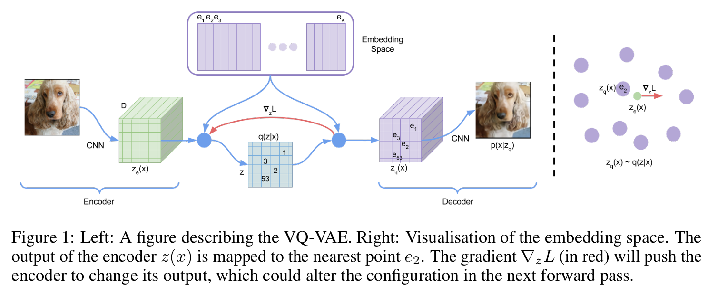

## VQ-VAE（向量量化变分自编码器）

### 概述

**VQ-VAE**（Vector Quantized VAE）是为了解决传统VAE存在的局限而提出的一种模型。传统VAE使用连续潜变量，可能会出现后验坍塌（posterior collapse）问题：当解码器很强大时，编码器的隐变量信息被忽略，模型几乎只依赖解码器来重构数据。VQ-VAE通过在编码器-解码器之间引入一个离散的代码簿（codebook）层，将连续隐空间离散化，使解码器被迫使用潜变量信息，从而避免了后验坍塌。同时，离散潜变量能够更有效地捕获数据中离散的结构特征（如语音中的音素、图像中的物体等），提升生成样本的质量。研究表明，采用离散潜变量的VQ-VAE在对数似然等指标上可以达到与连续潜变量模型相当的性能。此外，VQ-VAE为后续的生成模型奠定了基础，其离散表示已被用于诸如 OpenAI 的 DALL·E 等先进模型中，证明了在图像、语音等多种任务上的实用价值。

### 模型结构

VQ-VAE 的结构可以看作是在自编码器（Autoencoder）基础上增加了一个向量量化层。包括三个主要部分：编码器（Encoder）、代码簿（Codebook）和解码器（Decoder）。模型工作过程如下：

- 编码器网络将输入数据 $x$ 映射到隐空间得到连续隐表示 $z_e(x)$。
- 然后，在隐空间插入向量量化操作：将 $z_e(x)$ 与代码簿中所有向量比较，找到距离最近的代码向量 $e_k$，并将其作为离散隐变量 $z_q(x)$ 传递给解码器。
- 解码器接收选中的代码向量序列作为输入，尝试重构出原始数据 $\hat{x}$。

这个过程中，编码器输出经过一个非线性离散化步骤（选取最近邻的码簿向量），整体可以被视为带有离散瓶颈的自动编码器。需要注意的是，在图像等高维数据场景下，编码器通常不会只输出单个隐向量，而是输出一个如 $32\times32$ 大小的隐向量网格（每个位置对应局部区域特征）。该网格中的每个向量都会独立地进行量化，均从同一个代码簿中选取最近的嵌入向量，这样虽然代码簿大小固定，但因为输出多个code，解码器可以组合出指数级丰富的重构结果。例如，若代码簿大小为512，隐空间网格维度为$32\times32$，则解码器理论上可生成多达 $512^{32\times32}$ 种不同组合的图像。由此可见，VQ-VAE 的离散瓶颈既限制了每个隐变量只能取有限集合中的值，又通过多元组合提供了巨大的表示能力。

### 向量量化机制

VQ-VAE的关键在于**向量量化（Vector Quantization）**操作，即将连续的编码器表示映射为离散的索引。具体机制包括以下几点：

#### 代码簿（Codebook）：

代码簿是一组可学习的嵌入向量集合，一般记为 $e = {e_1, e_2, \dots, e_K}$，其中 $K$ 是代码簿中向量的数量（离散latent空间的大小），每个向量维度为 $D$。这些向量可以看作原型向量或簇心，代表了离散潜在空间中可能取值的中心。模型的编码器输出将被强制映射到这些原型向量上，从而得到一个离散化的表示。

#### 最近邻查找

对于每一个编码器输出向量 $z_e(x)$，VQ-VAE 选择与其欧氏距离最近的代码簿向量 $e_k$ 来表示。用公式表示即为：$k = \arg\min_i | z_e(x) - e_i |_2$，然后令离散隐表示 $z_q(x) = e_k$。这个最近邻查找（nearest neighbor lookup）过程实现了连续向量到离散代码的量化，对应于选取一个 1-of-K 的离散编码。解码器随后接收 $z_q(x)$ 作为输入进行重构。由于每个 $z_e(x)$ 都被替换为最近的离散向量 $e_k$，该操作本质上相当于对隐空间进行了k-means量化（聚类），把隐表示压缩到有限的聚类中心上。

#### 直通估计（Straight-Through Estimator）

由于最近邻的取整操作是非平滑、不可微的，直接反向传播梯度将无法传递到编码器。为了解决这一问题，VQ-VAE 使用了直通梯度估计器：在前向传播时使用离散的 $z_q(x)$，但在反向传播时忽略量化操作的离散性，将来自解码器的梯度直接传给编码器的输出 $z_e(x)$。简单而言，就是在反传过程中将量化操作视作恒等映射处理——解码器对 $z_q(x)$ 的梯度被直接拷贝给 $z_e(x)$，从而更新编码器参数。这种近似的梯度传播方法允许编码器仍然能够通过重构误差来更新，即使中间有一个非可导的选取最近邻操作。在实现中，这通常利用框架对张量的截断梯度（stop-gradient）操作来完成：量化步骤的前向输出用于后续计算，但对该输出梯度设为零，只让原始编码器输出承担梯度。这个技巧有效地绕过了量化的不连续性，实践中被证明可以稳定地训练VQ-VAE。

### 损失函数

VQ-VAE 的训练目标由三部分损失项组成，各自针对模型的不同组件进行优化：

#### 重构损失（reconstruction loss）

重构损失（reconstruction loss）是衡量模型重构输出 $\hat{x}$ 与原始输入 $x$ 之间差异的损失，用以训练编码器和解码器。根据任务不同，可采用均方误差（MSE）或对数似然损失（如像素级交叉熵）等形式表示。重构损失鼓励编码器-解码器能够尽可能准确地还原输入数据，是整个模型优化的主要驱动力。在公式中通常记为 $L_{\text{reconstruction}} = -\log p(x|z_q(x))$，表示对数据点在给定离散隐变量下的似然的负对数。

#### 代码簿损失（codebook loss）

代码簿损失（codebook loss，又称嵌入对齐损失）用于训练代码簿向量的损失项。由于直通估计的使用，重构误差的梯度并不会更新代码簿（梯度已传给编码器而对代码簿截断），因此需要额外机制来学习代码簿。本项通过最小化编码器输出 $z_e(x)$ 与所选代码向量 $e_k$ 之间的平方误差来更新代码簿向量，使其朝向编码器输出的方向移动。具体形式为 $L_{\text{codebook}} = | \text{sg}[z_e(x)] - e_k |_2^2$，其中 $\text{sg}$ 表示停止梯度操作（其作用是让括号内的张量在反向传播时梯度为零）。由于 $z_e(x)$ 前面加了 stop-gradient，这部分损失只对代码簿参数 $e$ 产生梯度，迫使相应的 $e_k$ 靠近当前的编码器输出。直观来说，代码簿损失不断调整每个嵌入向量的位置，以更好地代表编码器实际输出的聚类中心，从而优化字典学习的效果。

#### 承诺损失（commitment loss）

承诺损失（commitment loss，也称承诺代价）用于训练编码器输出的损失项。其目的在于约束编码器输出“承诺”于选定的离散向量，避免编码器输出无限增长或者频繁切换代码造成不稳定。形式为 $L_{\text{commitment}} = \beta | z_e(x) - \text{sg}[e_k] |_2^2$，其中系数 $\beta$ 为权重超参数，用于平衡重构误差和承诺代价的重要性这里对代码簿向量 $\text{sg}[e_k]$ 应用了停止梯度，因此此项损失只会使编码器参数更新（代码簿不受影响），推动 $z_e(x)$ 靠近已选的代码簇中心 $e_k$。这样可以防止编码器输出偏离代码簿过远，促使编码器尽可能产生稳定且贴合代码簇的表示。原论文指出，模型对 $\beta$ 的选择相对鲁棒，在 $0.1$到$2.0$ 范围内效果差别不大，一般可以取 $\beta \approx 0.25$。

#### 总损失

总的训练损失就是上述三部分之和：

$$
L_\text{VQ-VAE}  =  L_\text{reconstruction}+L_\text{codebook}+L_\text{commitment}
$$

其中重构损失影响编码器和解码器的更新，代码簿损失只更新代码簿参数，承诺损失则只作用于编码器输出。需要注意的是，在 VQ-VAE 中我们假设隐变量符合均匀分布的先验（即任何代码出现的概率相等），因此对应的 KL 散度项为常数，不随模型参数变化，在训练时通常被忽略不计。这意味着，与传统VAE不同，VQ-VAE的目标函数中没有显式的KL正则项，模型复杂度的约束主要由离散瓶颈和承诺损失来实现。

### 缺陷及改进

#### 代码簿崩溃（codebook collapse）

在训练VQ-VAE时，需要注意一些潜在的问题和相应的对策。其中最重要的之一是**代码簿崩溃（codebook collapse）**现象。代码簿崩溃是指模型在训练过程中只使用了代码簿中很小一部分向量，大部分代码词（codeword）长期闲置未被使用，或者不同代码词收敛到几乎相同的取值，导致有效的离散表示容量大幅降低。这种情况会削弱模型的表示能力，相当于隐空间的多样性坍缩。造成崩溃的原因可能是编码器和解码器的更新不平衡、超参数设置不当（例如承诺损失权重过大使编码器不愿改变代码）等。为缓解和避免代码簿崩溃，实践中常用以下训练技巧。

#### 指数移动平均（EMA）更新

使用**EMA算法**来更新代码簿向量，而非直接反传梯度更新。这种方法在第二版VQ-VAE中得到采用，被发现可以使代码簿的更新更加平滑稳定，避免单个代码向量由于梯度波动出现剧烈变化或竞争失败。具体做法是每次前向传播时把每个隐向量指派给最近的代码向量，统计每个代码向量本轮对应的“样本和+样本数”，再用衰减系数把历史统计与本轮统计做加权融合，得到新的累计和与计数，最后用它们的比值更新码本（近似把簇心靠近最近一次观测到的数据分布）。EMA更新能使训练更平滑，避免梯度直接穿过量化带来的不稳定和码本崩溃，有效防止训练初期由于随机原因某些代码一直未得到更新而废弃的情况。

#### 代码重置（Codebook Reset）

这是针对长期未被使用的代码词的一种处理策略。训练过程中持续监视每个代码向量被选中的频率，如果发现某些代码在较长一段迭代中从未或很少被使用，可以将这些“失效”代码向量重置——例如用当前mini-batch中随机某些编码器输出向量来替换它们。通过重新初始化闲置的代码词，使其有机会迁移到数据分布较密集的区域参与表示，确保代码簿的覆盖面不至于过偏。Code reset 的操作类似于 k-means 聚类中对空簇中心的处理，可以提高代码簿利用率，对抗崩溃。

#### 增加多样性正则

在损失函数中显式引入鼓励代码使用丰富度的正则项。例如，可以加入一个熵正则化或 Code usage 多样性损失，鼓励编码器的离散输出分布接近均匀。具体做法包括最大化离散后验 $q(z|x)$ 的熵，或在一段时间内统计代码使用频率分布，与均匀分布计算KL散度作为惩罚。这样的项在数学上推动模型充分利用更多的代码词，而不是集中在少数几个上。研究和实操表明，适度的熵/多样性正则能有效缓解代码簿崩溃，提高码本利用率。不过需要注意权衡，正则项过强可能反而干扰重构性能，因此通常将其作为辅助监控指标或微弱正则。

#### 超参数与训练策略

合理选择并调整一些关键超参数对训练稳定也很重要。例如，承诺损失权重 $\beta$ 需要平衡编码器输出移动和代码簿更新的速度：$\beta$ 过大会让编码器过于死板地黏着当前代码（减少代码使用的探索），过小则可能出现编码器输出变化太快代码簿跟不上等情况。通常在0.25左右取得较好平衡，但也需视具体任务调节。另外，代码簿大小应与数据复杂度匹配；过大的码本在数据不足时更易出现大量代码闲置而崩溃，必要时可以减少码本规模或采用分层码本来提升利用率。训练时使用较大的batch size、充分的训练步数也有助于编码器更稳定地使用各种代码词。一些实现中还采取分阶段训练策略：先固定解码器训练编码器和码本，使其学到初步离散表示，再释放解码器一起优化，以防止解码器过早主导重构而忽略潜变量。

总之，针对VQ-VAE特有的训练挑战，需要结合上述方法细心调校，监控代码簿的使用情况。幸运的是，这些技巧已经在很多实践中验证有效，使我们能够较稳定地训练出高质量的VQ-VAE模型而不出现严重的崩溃或失效问题。

### 应用场景

VQ-VAE 提供了一种将数据压缩到离散表示的强大手段，因而在多个领域获得了成功应用：

- **图像生成与压缩**：VQ-VAE 最初在图像生成任务上展示了其威力。通过先训练VQ-VAE将图像压缩成离散代码，再训练一个像素级的自回归模型（如 PixelCNN 或 Transformer）作为代码序列的先验分布，模型可以生成高质量且多样的图像样本。这种两阶段方法中，VQ-VAE负责学习图像的离散表征，将复杂图像简化为易于建模的离散token序列；随后强大的生成模型在这个离散空间中学习数据分布。实验证明，该策略能够在无监督情况下生成逼真的图像。例如，VQ-VAE 在 ImageNet 上训练后结合 PixelCNN prior，可以生成清晰的自然图像。后续的VQ-VAE-2 引入分层多尺度的离散表示和更强的先验，进一步提高了生成图像的一致性和保真度，能够产生接近原始分辨率的高质量图像。此外，在图像压缩领域，VQ-VAE的离线码本量化与自回归建模也被用于无损/有损压缩算法中，以在保证感知质量的同时大幅降低比特率。
- **语音和音频建模**：VQ-VAE 在语音生成与音频表示学习方面的应用也非常成功。原始论文中，将VQ-VAE应用于语音数据，模型在无监督情况下自动学出了类似**音素**的离散单元——即代码簿的向量开始对应语音中的基础声音单位。这说明VQ-VAE能够从原始音频中提取出有意义的离散特征，而这些特征对于下游任务（如语音合成、语者识别）非常有用。进一步地，通过在解码器端输入不同的说话人ID等条件，VQ-VAE还能实现说话人转换等应用：即编码内容不变但用另一人的声音重构，同一段代码可以由解码器转换成不同音色的语音。OpenAI 的 Jukebox 项目则将 VQ-VAE 扩展到音乐领域，采用分级VQ编码将原始音乐波形压缩为多层级的离散码，再用 Transformer 模型在这些代码序列上进行建模，成功地生成了长时段且结构丰富的歌曲音乐。这些应用展示了VQ-VAE 在音频领域捕捉长期结构和离散语义单元的能力，使得高保真语音和音乐的生成成为可能。
- **自然语言与序列建模**：虽然自然语言本身天生是离散符号序列，但VQ-VAE思路在文本序列的潜在离散表示方面也有所探索。在一些文本生成或机器翻译任务中，研究者引入VQ-VAE作为中间瓶颈，将连续的隐含语义向量离散化，以获取更可控和解释的表示。例如，有工作将VQ-VAE用于句子级别的生成模型，利用离散潜变量来表示整个句子的高阶语义结构，避免了传统序列VAE中经常出现的posterior collapse问题。这些离散语义码可以看作模型自动学习出的“句子代码”，为生成器提供了更明确的信号。另一些研究则将VQ-VAE引入到Transformer语言模型中，获取隐层的离散概念单元，以改善生成的多样性和语义一致性。总体而言，在语言模型中使用离散表示可以增强模型对全局结构的把控，提供一种调节语义的“开关”。例如最新的T5VQVAE模型通过在Transformer VAE中嵌入离散空间，提升了生成语义控制能力，在诸多文本生成指标上优于以往方法。虽然这方面应用还在探索中，但初步结果显示离散潜变量有助于学习更抽象的语言结构，对于长文本或多样风格的生成具有潜力。
- **强化学习与其他领域**：VQ-VAE 的离散表示思想同样被尝试应用在一些其他领域，例如强化学习（RL）中的状态表示。研究者将高维感知输入（如游戏画面）通过VQ-VAE压缩成离散代码，发现这些代码往往对应环境中的\关键物体或地形，从而为下游的决策提供了更简洁有用的状态特征。这种方式可以在不提供额外标注的情况下，让智能体自行学习离散的“概念”，从而改进长时策略的学习。在机器人控制、动作生成等序列决策任务中，也有尝试使用VQ-VAE提取离散的运动primitive或姿态代码，以简化连续控制的问题难度。总体来说，凡是需要从高维连续信号中提炼出抽象符号的场景，都可能看到VQ-VAE的身影。

### 与VAE的对比

**潜在空间类型**：VAE 的隐空间是连续的，多采用高斯等连续分布来建模潜变量；而 VQ-VAE 的隐空间由离散的代码组成，通过代码簿的有限集合来表示。换言之，VAE 的隐向量每一维可以是任意实数，而 VQ-VAE 的每个潜变量只能取有限个离散值（由代码簿索引决定）。

**编码器输出与推断方式**：VAE 的编码器输出的是潜在分布的参数（如高斯分布的均值和方差），训练时需通过重参数化技巧从该分布中采样连续隐向量 $z$，这会在训练目标中引入一个 KL 散度项用于正则化；相比之下，VQ-VAE 的编码器直接输出确定的隐向量，并通过最近邻量化得到离散的 $z_q$，因而后验分布是退化为 one-hot 的确定性分布（$q(z=k|x)=1$ 对应选中的代码，其它为0）。VQ-VAE 训练时不需要随机采样步骤，也没有复杂的后验近似，编码器更像是被“硬编码”成一个近邻查询函数，这简化了训练过程且避免了VAE中因随机采样导致的梯度高方差问题。

**损失函数组成**：传统 VAE 的目标由重构误差和KL正则项组成，即在保证重构数据的同时逼近隐变量先验（通常为标准正态）；而 VQ-VAE 没有显式的KL项，取而代之的是代码簿损失和承诺损失来确保编码器输出与离散代码簇相匹配，并维持隐空间稳定。也就是说，VAE 通过KL散度鼓励连续隐向量分布接近先验，而VQ-VAE通过额外的MSE损失来拉近编码器输出和嵌入向量，从另一个角度实现对隐空间的约束。

**先验分布处理**：在 VAE 中，隐变量先验 $p(z)$ 一般预先固定为标准正态分布或其他简单分布，训练时通过最小化KL散度将编码器后验拉向该先验；VQ-VAE 则是训练时假定先验均匀（不显式参与优化），模型训练完成后再对离散隐变量学习一个新的先验分布。通常做法是训练一个自回归模型（如 PixelCNN、Transformer）作为离散代码序列的先验，实现对隐空间复杂分布的建模。这样VQ-VAE的先验不局限于简单分布，而是可以由强大的模型来拟合数据的隐结构。

**后验坍塌问题**：VAE 常出现后验坍塌，尤其在解码器为强自回归模型时，优化倾向于让编码器输出接近先验、忽略潜变量，从而KL项很小但重构主要靠解码器记忆，导致潜变量的语义无效。相比之下，VQ-VAE 由于隐空间被量化为有限的离散值，解码器必须依赖这些离散代码才能重构输入，因此极大程度缓解了后验坍塌。实际上，VQ-VAE 的设计初衷之一就是通过离散瓶颈强制使用潜变量信息，使其不会被强力解码器所忽略。这使得VQ-VAE能在不引入KL惩罚的情况下，依然学到有用的隐表示。

**潜在表示的表达能力**：连续隐空间的VAE在表示某些离散的细节时可能效率不高，例如图像中的清晰边缘、重复纹理，或语音中的符号化特征，容易因为取均值而变得模糊。而VQ-VAE的离散隐变量更擅长捕获这类信息，使生成结果更清晰、多样。实验证明，原始VQ-VAE在图像生成质量上优于典型VAE，可生成分辨率更高、细节更锐利的样本。这是因为离散代码不会发生连续隐变量那种“插值模糊”效应，且配合强先验可以确保抽样结果接近真实数据分布。

**训练难点与稳定性**：VAE 的训练相对稳定，因为优化目标（ELBO）对参数是平滑可微的，但可能面临KL权重选择、posterior collapse等问题；VQ-VAE 的训练需要处理非连续的量化操作，尽管通过straight-through技巧解决了梯度传播，但仍可能出现码本利用不充分等问题。此外，VAE训练中编码器梯度直接来自重构和KL项，而VQ-VAE中部分梯度被截断，需要额外的嵌入更新机制，这使得调参有所不同。然而，总体而言VQ-VAE在避免后验坍塌、提高表示离散性方面的收益，使其在许多任务上成为优于标准VAE的选择。

### VQ-VAE 的发展

#### VQ-VAE-2

VQ-VAE-2 是对原始VQ-VAE的改进版本，由DeepMind团队在2019年提出。VQ-VAE-2 的核心思想是在模型中引入多层次的离散隐空间：它采用分层编码器-解码器结构，先提取高等级的粗粒度离散表示，再提取低等级的细粒度离散表示，从上到下逐级生成图像。这样做的好处是顶层的离散code可以捕捉全局概况（如图像的大致布局），底层code捕捉局部细节，从而提高生成图像的一致性和细节质量。此外，VQ-VAE-2 引入了一种基于 PixelCNN 的强先验模型：它在最高层离散代码上训练PixelCNN（或PixelSnail）来建模代码分布，并在下层生成时逐级条件采样。凭借分层表征和强先验，VQ-VAE-2 能生成高保真且多样的图像样本，显著优于一层结构的VQ-VAE。一些公开实验表明，VQ-VAE-2 可以在Imagenet这样的数据集上生成接近真实分辨率（$256\times256$或更高）的图像，其感知质量可与GAN等方法相媲美。这确立了离散VAE在大型图像生成任务中的地位。同时，VQ-VAE-2 在训练技术上也做了改进，例如使用EMA更新码本（上文提及）来替代代码簿损失，进一步缓解了训练不稳定和code collapse问题。可以说，VQ-VAE-2 的出现证明了离散潜变量模型在复杂生成任务上的可行性和优越性。

#### 结合 Transformer 等自回归模型

近几年，随着Transformer在生成建模上的成功，将 VQ-VAE 与 Transformer 结合成为了热门趋势。基本思路是利用 VQ-VAE 将高维数据（如图像、音频）转换成离散 token 序列，然后用 Transformer（如GPT）在这些 token 上学习分布，用于生成新样本。这种“两段式”模型中，VQ-VAE负责学习离散表示，Transformer负责在离散空间里做序列预测。典型的例子就是 OpenAI 的 DALL·E：它先训练一个VQ-VAE将图像映射为离散码，再训练一个大规模Transformer以文本描述为条件来自回归地生成图像代码序列，最后通过VQ-VAE的解码器得到图像。DALL·E 的成功展示了该思路在多模态生成上的强大威力。同样，前述的 Jukebox 使用了层级VQ-VAE压缩音乐、Transformer生成音乐codes，实现了长时音乐的生成。将Transformer引入离散空间具有几个显著优点：Transformer强大的长程依赖建模能力可以充分发挥，离散token使得输出空间有限且利于概率估计，从而生成质量和样本多样性都显著提升。实践证明，VQ-VAE 与 Transformer 是天然契合的组合：前者提供表示能力，后者提供建模能力，两者结合几乎可以扩展生成模型到任意复杂的数据分布。只要有足够的算力和数据支撑，这种方法能够在图像、音频、文本等领域生成极其高质量的内容。目前，许多最前沿的生成模型都采用了这种范式（例如把 VQ-VAE 或其变种作为编码器，Transformer作为主生成器)。可以预见，在未来相当长一段时间内，VQ-VAE+Transformer 的架构仍将是生成建模领域的重要工具，离散表示学习也会持续为多模态AI的发展提供支持
