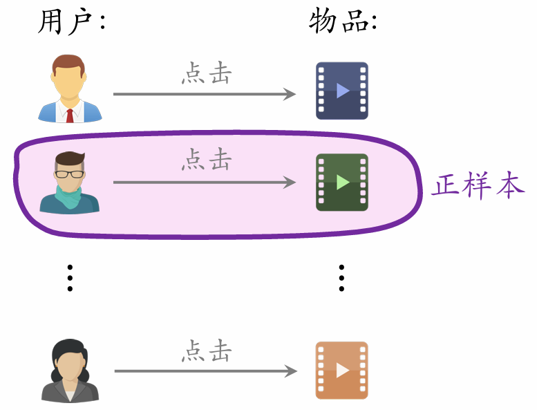

# 王树森推荐系统学习笔记\_召回

## 召回

### 基于物品的协同过滤(ItemCF)

#### 基本思想

如果用户喜欢物品 `item_1`，而且物品 `item_1` 与 `item_2` 相似，那么用户很可能喜欢物品 `item_2`。

#### ItemCF 的实现

用户对物品的兴趣： `like(user, item_j)`

物品之间的相似度： `sim(item_j, item)`

预估用户对候选物品的兴趣： `∑_j like(user, item_j) × sim(item_j, item)`

#### 物品的相似度

如果两个物品的受众重合度较高，就判定为两个物品相似。

**计算物品相似度**(考虑用户喜欢的程度)

喜欢物品 `i_1` 的用户记作集合 `W_1`

喜欢物品 `i_2` 的用户记作集合 `W_2`

定义交集 `V = W_1 ∩ W_2`

两个物品的相似度：

```
sim(i_1, i_2) = |V| / √(|W_1| · |W_2|)
```

**计算物品相似度(考虑用户喜欢的程度)**

喜欢物品 `i_1` 的用户记作集合 `W_1`

喜欢物品 `i_2` 的用户记作集合 `W_2`

定义交集 `V = W_1 ∩ W_2`

两个物品的相似度：

```
sim(i_1, i_2) = (∑_{v ∈ V} like(v, i_1) · like(v, i_2)) /
                 (√(∑_{u_1 ∈ W_1} like²(u_1, i_1)) · √(∑_{u_2 ∈ W_2} like²(u_2, i_2)))
```

#### ItemCF 召回的完整流程

**事先做离线计算**

建立"用户 ➝ 物品"的索引

- 记录每个用户最近点击、交互过的物品ID。
- 给定任意用户ID，可以找到他近期感兴趣的物品列表。

建立"物品 ➝ 物品"的索引

- 计算物品之间两两相似度。
- 对于每个物品，索引它最相似的 `k` 个物品。
- 给定任意物品ID，可以快速找到它最相似的 `k` 个物品。

**线上做召回**

1. 给定用户ID，通过"用户 ➝ 物品"索引，找到用户近期感兴趣的物品列表（last-n）。
2. 对于 last-n 列表中每个物品，通过"物品 ➝ 物品"的索引，找到 top-k 相似物品。
3. 对于取回的相似物品（最多有 `nk` 个），用公式预估用户对物品的兴趣分数。
4. 返回分数最高的 100 个物品，作为推荐结果。

⽤索引，离线计算量⼤，线上计算量⼩。

#### 总结

**ItemCF的原理**

用户喜欢物品 `i_1` ，那么用户喜欢与物品 `i_1` 相似的物品 `i_2`。

物品相似度：

- 如果喜欢 `i_1`、`i_2` 的用户有很大的重叠，那么 `i_1` 与 `i_2` 相似。

- 公式：

```
sim(i_1, i_2) = |W_1 ∩ W_2| / √(|W_1| · |W_2|)
```

**ItemCF 召回通道**

维持两个索引：

- 用户 ➝ 物品列表：用户最近交互过的 `n` 个物品。
- 物品 ➝ 物品列表：相似度最高的 `k` 个物品。

线上做召回：

- 利用两个索引，每次取回 `nk` 个物品。
- 预估用户对每个物品的兴趣分数：

```
∑_j like(user, item_j) × sim(item_j, item)
```

- 返回分数最高的 100 个物品，作为召回结果。

### Swing召回通道

#### Swing 模型

用户 `u_1` 喜欢的物品记作集合 `J_1`。

用户 `u_2` 喜欢的物品记作集合 `J_2`。

定义两个用户的重合度：

```
overlap(u_1, u_2) = |J_1 ∩ J_2|
```

用户 `u_1` 和 `u_2` 的重合度高，则他们可能来自一个小圈子，要降低他们的权重。

#### Swing 模型

喜欢物品 `i_1` 的用户记作集合 `W_1`。

喜欢物品 `i_2` 的用户记作集合 `W_2`。

定义交集 `V = W_1 ∩ W_2`。

两个物品的相似度：

```
sim(i_1, i_2) = ∑_{u_1 ∈ V} ∑_{u_2 ∈ V} 1/(α + overlap(u_1, u_2))
```

#### 总结

- Swing 与 ItemCF 唯一的区别在于物品相似度。
- **ItemCF**：两个物品重合的用户比例高，则判定两个物品相似。
- **Swing**：额外考虑重合的用户是否来自一个小圈子。
  - 同时喜欢两个物品的用户记作集合 `V`。
  - 对于 `V` 中的用户 `u_1` 和 `u_2`，重合度记作 `overlap(u_1, u_2)`。
  - 两个用户重合度大，则可能来自一个小圈子，权重降低。

### 基于用户的协同过滤（UserCF）

#### 基本思想

如果用户 `user_1` 跟用户 `user_2` 相似，而且 `user_2` 喜欢某物品， 那么用户 `user_1` 也很可能喜欢该物品。

#### UserCF 的实现

用户之间的相似度： `sim(user, user_j)`

用户对物品的兴趣： `like(user_j, item)`

预估用户对候选物品的兴趣： `∑_j sim(user, user_j) × like(user_j, item)`

#### 用户的相似度

**计算用户相似度**

用户 `u_1` 喜欢的物品记作集合 `J_1`。

用户 `u_2` 喜欢的物品记作集合 `J_2`。

定义交集 `I = J_1 ∩ J_2`。

两个用户的相似度：

```
sim(u_1, u_2) = |I| / √(|J_1| · |J_2|)
```

**降低热门物品权重**

用户 `u_1` 喜欢的物品记作集合 `J_1`。

用户 `u_2` 喜欢的物品记作集合 `J_2`。

定义交集 `I = J_1 ∩ J_2`。

两个用户的相似度：

```
sim(u_1, u_2) = (∑_{l ∈ I} 1/log(1 + n_l)) / √(|J_1| · |J_2|)
```

其中，`n_l` 表示喜欢物品 `l` 的用户数量，反映物品的热门程度。

#### UserCF 召回的完整流程

**事先做离线计算**

建立"用户 ➝ 物品"的索引

- 记录每个用户最近点击、交互过的物品ID。
- 给定任意用户ID，可以找到他近期感兴趣的物品列表。

建立"用户 ➝ 用户"的索引

- 对于每个用户，索引他最相似的 `k` 个用户。
- 给定任意用户ID，可以快速找到他最相似的 `k` 个用户。

**线上做召回**

1. 给定用户ID，通过"用户 ➝ 用户"索引，找到 top-k 相似用户。
2. 对于每个 top-k 相似用户，通过"用户 ➝ 物品"索引，找到用户近期感兴趣的物品列表（last-n）。
3. 对于取回的 `nk` 个相似物品，用公式预估用户对每个物品的兴趣分数。
4. 返回分数最高的 100 个物品，作为召回结果。

#### 总结

**UserCF 的原理**

用户 `u_1` 跟用户 `u_2` 相似，而且 `u_2` 喜欢某物品，那么 `u_1` 也可能喜欢该物品。

**用户相似度**：

- 如果用户 `u_1` 和 `u_2` 喜欢的物品有很大的重叠，那么 `u_1` 和 `u_2` 相似。
- **公式**：

```
sim(u_1, u_2) = |J_1 ∩ J_2| / √(|J_1| · |J_2|)
```

**UserCF 召回通道**

维持两个索引：

- 用户 ➝ 物品列表：用户近期交互过的 `n` 个物品。
- 用户 ➝ 用户列表：相似度最高的 `k` 个用户。

线上做召回：

- 利用两个索引，每次取回 `nk` 个物品。
- 预估用户 `user` 对每个物品 `item` 的兴趣分数：

```
∑_j sim(user, user_j) × like(user_j, item)
```

- 返回分数最高的 100 个物品，作为召回结果。

### 离散特征处理

1. **建立字典**：把类别映射成序号。
   - 中国 ➔ 1
   - 美国 ➔ 2
   - 印度 ➔ 3

2. **向量化**：把序号映射成向量。
   - One-hot编码：把序号映射成高维稀疏向量。
   - Embedding：把序号映射成低维稠密向量。

#### 独热编码(one-hot编码)

**独热编码表示国籍特征**

国籍：中国、美国、印度等 200 种类别。

字典：中国 ➔ 1，美国 ➔ 2，印度 ➔ 3，⋯

One-hot编码：用 200 维稀疏向量表示国籍。

- 未知 ➔ 0 ➔ `[0,0,0,0,⋯,0]`
- 中国 ➔ 1 ➔ `[1,0,0,0,⋯,0]`
- 美国 ➔ 2 ➔ `[0,1,0,0,⋯,0]`
- 印度 ➔ 3 ➔ `[0,0,1,0,⋯,0]`

#### Embedding（嵌入）

可以将独热编码映射为嵌入向量

参数数量：向量维度 × 类别数量。

- 设 embedding 得到的向量都是 4 维的。
- 一共有 200 个国籍。
- 参数数量 = 4 × 200 = 800。

编程实现：TensorFlow、PyTorch 提供 embedding 层。

- 参数以矩阵的形式保存，矩阵大小是 向量维度 × 类别数量。
- 输入是序号，比如 "美国"的序号是 2。
- 输出是向量，比如 "美国"对应参数矩阵的第 2 列。


#### 总结

离散特征处理：one-hot 编码、embedding。

类别数量很大时，用 embedding。

- Word embedding。
- 用户 ID embedding。
- 物品 ID embedding。

### 矩阵补充


embedding 层矩阵 A 输出的向量 a 是矩阵的一列，用户的数量等于矩阵的列数

embedding 层矩阵 B 输出的向量 b 是矩阵的一列，物品的数量等于矩阵的列数

#### 基本想法

用户 embedding 参数矩阵记作 **A**。第 `u` 号用户对应矩阵第 `u` 列，记作向量 `a_u`

物品 embedding 参数矩阵记作 **B**。第 `i` 号物品对应矩阵第 `i` 列，记作向量 `b_i`

内积 `⟨a_u, b_i⟩` 是第 `u` 号用户对第 `i` 号物品兴趣的预估值

训练模型的目的是学习矩阵 **A** 和 **B**，使得预估值拟合真实观测的兴趣分数，矩阵 **A** 和 **B** 是embedding层的参数

#### 数据集

数据集：(用户ID, 物品ID, 兴趣分数) 的集合，记作  
`Ω = {(u, i, y)}`。

数据集中的兴趣分数是系统记录的，例如：

- 曝光但是没有点击 ➔ 0 分
- 点击、点赞、收藏、转发 ➔ 各算 1 分
- 分数最低是 0，最高是 4

#### 训练

把用户 ID、物品 ID 映射成向量。

- 第 `u` 号用户 ➔ 向量 `a_u`
- 第 `i` 号物品 ➔ 向量 `b_i`

求解优化问题，得到参数 **A** 和 **B**，可采用梯度下降

```
min_{A, B} ∑_{(u,i,y) ∈ Ω} (y - ⟨a_u, b_i⟩)²
```

#### 矩阵补充


模型训练后可以将灰色位置补全，这时再根据兴趣分数做推荐

#### 在实践中效果不好……

**缺点1**：仅用 ID embedding，没利用物品、用户属性。

- 物品属性：类别、关键词、地理位置、作者信息。
- 用户属性：性别、年龄、地理定位、感兴趣的类别。
- 双塔模型可以看做矩阵补充的升级版。

**缺点2**：负样本的选取方式不对。

- 样本：用户—物品的二元组，记作 `(u, i)`。
- 正样本：曝光之后，有点击、交互。（正确的做法）
- 负样本：曝光之后，没有点击、交互。（错误的做法）

**缺点3**：做训练的方法不好。

- 内积 `⟨a_u, b_i⟩` 不如余弦相似度。
- 用平方损失（回归），不如用交叉熵损失（分类）。

#### 模型存储

1. 训练得到矩阵 **A** 和 **B**。
   - **A** 的每一列对应一个用户。
   - **B** 的每一列对应一个物品。

2. 把矩阵 **A** 的列存储到 key-value 表。
   - key 是用户 ID，value 是 **A** 的一列。
   - 给定用户 ID，返回一个向量（_用户的 embedding_）。

3. 矩阵 **B** 的存储和索引比较复杂。

#### 线上服务

1. 把用户 ID 作为 key，查询 key-value 表，得到该用户的向量，记作 `a`。

2. 最近邻查找：查找用户最有可能感兴趣的 `k` 个物品，作为召回结果。
   - 第 `i` 号物品的 embedding 向量记作 `b_i`。
   - 内积 `⟨a, b_i⟩` 是用户对第 `i` 号物品兴趣的预估。
   - 返回内积最大的 `k` 个物品。

> **如果枚举所有物品，时间复杂度正比于物品数量。因为要找到 k 个最感兴趣的个物品就要算出来用户对所有物品的兴趣分数**

#### 支持最近邻查找的系统

**系统**：Milvus、Faiss、HnswLib、等等。

**衡量最近邻的标准**：

- 欧式距离最小（L2 距离）
- 向量内积最大（内积相似度）
- 向量夹角余弦最大（cosine 相似度）


a 代表某个用户的embedding向量，图中的散点代表物品的embedding向量。要找到与 a 最近邻的向量（最近邻在矩阵补充中就是向量内积最大）。


将图中的散点划分为若干区域，每一个区域用一个向量来代替。也就是用一个区域向量来代替所在区域内的若干物品向量。


计算与 a 最近邻的区域向量，找到后再计算出这个区域内与 a 最近邻的 k 个物品向量。

#### 总结

**矩阵补充**

- 把物品 ID、用户 ID 做 embedding，映射成向量。
- 两个向量的内积 `⟨a_u, b_i⟩` 作为用户 `u` 对物品 `i` 兴趣的预估。
- 让 `⟨a_u, b_i⟩` 拟合真实观测的兴趣分数，学习模型的 embedding 层参数。
- 矩阵补充模型有很多缺点，效果不好。

**线上召回**

- 把用户向量 `a` 作为 query，查找使得 `⟨a, b_i⟩` 最大化的物品 `i`。
- 暴力枚举速度太慢。实践中用近似最近邻查找。
- Milvus、Faiss、HnswLib 等向量数据库支持近似最近邻查找。

### 双塔模型：模型和训练

#### 双塔模型


**双塔模型的训练**

- Pointwise：独⽴看待每个正样本、负样本，做简单的 ⼆元分类。
- Pairwise：每次取⼀个正样本、⼀个负样本。
- Listwise：每次取⼀个正样本、多个负样本。

**正负样本的选择**

- 正样本：用户点击的物品。
- 负样本 `[1,2]`：
  - 没有被召回的？
  - 召回但是被粗排、精排淘汰的？
  - 曝光但是未点击的？

#### Pointwise训练

- 把召回看做二元分类任务。
- 对于正样本，鼓励 `cos(a, b)` 接近 `+1`。
- 对于负样本，鼓励 `cos(a, b)` 接近 `-1`。
- 控制正负样本数量为 `1:2` 或者 `1:3`。

#### Pairwise训练

两个物品塔的参数是相同的。


**基本想法**：鼓励 `cos(a, b^+)` 大于 `cos(a, b^-)`。

- 如果 `cos(a, b^+)` 大于 `cos(a, b^-) + m`，则没有损失。其中m为超参数，需要自己设置。
- 否则，损失等于 `cos(a, b^-) + m - cos(a, b^+)`。

**损失函数**

**Triplet hinge loss:**

```
L(a, b^+, b^-) = max{0, cos(a, b^-) + m - cos(a, b^+)}
```

**Triplet logistic loss:**

```
L(a, b^+, b^-) = log(1 + exp[σ · (cos(a, b^-) - cos(a, b^+))])
```

#### Listwise 训练

- 一条数据包含：
  - 一个用户，特征向量记作 `a`。
  - 一个正样本，特征向量记作 `b^+`。
  - 多个负样本，特征向量记作 `b_1^-, ..., b_n^-`。

- 鼓励 `cos(a, b^+)` 尽量大。

- 鼓励 `cos(a, b_1^-), ..., cos(a, b_n^-)` 尽量小。


鼓励 `cos(a, b^+)` 尽量接近于1，鼓励 `cos(a, b_1^-), ..., cos(a, b_n^-)` 尽量接近于0

损失函数为交叉熵损失函数。

#### 总结

**双塔模型**

- 用户塔、物品塔各输出一个向量。
- 两个向量的余弦相似度作为兴趣的预估值。

- 三种训练方式：
  - **Pointwise**：每次用一个用户、一个物品（可正可负）。
  - **Pairwise**：每次用一个用户、一个正样本、一个负样本。
  - **Listwise**：每次用一个用户、一个正样本、多个负样本。

**不适用于召回的模型：前期融合模型**


采用双塔模型这种后期融合的召回方式，其优点在于先前就可以借助物品塔计算好所有物品的表示。之后每次来一个用户，将其通过用户塔可以得到他的表示，借助快速最近邻方法，可以快速召回k个和用户表示相近的物品。

而如果采用前期融合的方式，就无法预先计算好所有物品的表示，要召回k个物品，必须让用户的特征和每个物品的特征融合后输入神经网络得到一个感兴趣分数，这样必须把每个物品都计算一遍，发挥不了快速最近邻的方法的优势。

### 双塔模型：正负样本

**正样本**

- 正样本：曝光⽽且有点击的⽤户—物品⼆元组。 （⽤户对物品感兴趣）

- 问题：少部分物品占据⼤部分点击，导致正样本 ⼤多是热门物品
- 解决⽅案：过采样冷门物品，或降采样热门物品
- 过采样（up-sampling）：⼀个样本出现多次
- 降采样（down-sampling）：⼀些样本被抛弃

**如何选择负样本**

召回，粗排，精排和重排的负样本选择标准不同


#### 简单负样本

**简单负样本：全体物品**

- 未被召回的物品，大概率是用户不感兴趣的。
- 未被召回的物品 ≈ 整体物品
- 从整体物品中做抽样，作为负样本。
- 均匀抽样 or 非均匀抽样？

**均匀抽样**：对冷门物品不公平

- 正样本大多是热门物品。
- 如果均匀抽样产生负样本，负样本大多是冷门物品。

**非均匀抽样**：目的是打压热门物品

- 负样本抽样概率与热门程度（_点击次数_）正相关。
- `抽样概率 ∝ (点击次数)^0.75`。 0.75是经验值。

**简单负样本：Batch内负样本**

- 一个 batch 内有 `n` 个正样本。

- 一个用户 `p` 和 `n-1` 个物品组成负样本。

- 这个 batch 内一共有 `n(n-1)` 个负样本。

- 都是简单负样本。（因为第一个用户不喜欢第二个物品。）

- 一个物品出现在 batch 内的概率 `∝ 点击次数`。 物品越热门，出现在batch内的概率就越高。

- 物品成为负样本的概率本该是 `∝ (点击次数)^0.75`，但在这里是 `∝ 点击次数`。

- 热门物品成为负样本的概率过大。

- 物品 _i_ 被抽样到的概率： `p_i ∝ 点击次数`
  物品越热门，被抽样到的概率就越高。

- 预估用户对物品 _i_ 的兴趣： `cos(a, b_i)`

- 做训练的时候，调整为： `cos(a, b_i) - log p_i`
  这样可以纠偏，避免打压热门物品
  具体原理： `cos(a, b_i) - log p_i` 作为训练用，物品越热门，这个值越小。当某热门物品与某冷门物品的 `cos(a, b_i)` 相同时，因为热门物品的 `cos(a, b_i) - log p_i` 更小，其训练所用的目标值就更小。当模型训练完成后，输入相同的热门物品与冷门物品，热门物品的 `cos(a, b_i)` 就大于冷门物品。




#### 困难负样本

**困难负样本**

- 被粗排淘汰的物品（比较困难）。
- 精排分数靠后的物品（非常困难）。

**对正负样本做二元分类**：

- 整体物品（简单）分类准确率高。
- 被粗排淘汰的物品（比较困难）容易分错。
- 精排分数靠后的物品（非常困难）更容易分错。

**训练数据**

- 混合几种负样本。

- 50% 的负样本是整体物品（简单负样本）。

- 50% 的负样本是没通过排序的物品（困难负样本）。

#### 常见的错误

训练找回模型不能用这类负样本

训练排序模型会⽤这类负样本


#### **选择负样本的原理**

**召回的目标**：快速找到用户可能感兴趣的物品。

- 整体物品（easy）：绝大多数是用户根本不感兴趣的。
- 被排序淘汰（hard）：用户可能感兴趣，但是不够感兴趣。
- 有曝光没点击（没用）：用户感兴趣，可能碰巧没有点击。
  - 可以作为排序的负样本， 不能作为召回的负样本。

#### 总结

- **正样本**：曝光而且有点击。

- **简单负样本**：
  - 整体物品。
  - batch 内负样本。

- **困难负样本**：被召回，但是被排序淘汰。

- **错误**：曝光，但是未点击的物品做召回的负样本。

### 双塔模型：线上召回和更新

#### 线上召回


**双塔模型的召回**

**离线存储**：把物品向量 `b` 存入向量数据库。

1. 完成训练之后，用物品塔计算每个物品的特征向量 `b`。
2. 把几亿个物品向量 `b` 存入向量数据库（比如 Milvus、Faiss、HnswLib）。
3. 向量数据库建索引，以便加速最近邻查找。

**线上召回**：查找用户最感兴趣的 k 个物品。

1. 给定用户 ID 和画像，线上用神经网络算用户向量 `a`。

2. 最近邻查找：
   - 把向量 `a` 作为 query，调用向量数据库做最近邻查找。
   - 返回余弦相似度最大的 k 个物品，作为召回结果。

事先存储物品向量 `b`，线上现算用户向量 `a`，why？

- 每做一次召回，用到一个用户向量 `a`，几亿物品向量 `b`。  
  （线上计算物品向量的代价过大。）

- 用户兴趣动态变化，而物品特征相对稳定。  
  （可以离线存储用户向量，但不利于推荐效果。）

#### 模型更新

**全量更新 vs 增量更新**

**全量更新**：今天凌晨，用昨天全天的数据训练模型。

- 在昨天模型参数的基础上做训练。（不是随机初始化）
- 用昨天的数据，训练 1 epoch，即每天数据只用一遍。
- 发布新的 **用户塔神经网络** 和 **物品向量**，供线上召回使用。
- 全量更新对数据流、系统的要求比较低。

**增量更新**：做 online learning 更新模型参数。

- 用户兴趣会随时发生变化。
- 实时收集线上数据，做流式处理，生成 TFRecord 文件。
- 对模型做 online learning，增量更新 ID Embedding 参数。
- 发布用户 ID Embedding，供用户塔在线上计算用户向量。


**问题**：能否只做增量更新，不做全量更新？

- 一天中每一时段用户的行为不同，小时级数据有偏；分钟级数据偏差更大。
- 全量更新：random shuffle 一天的数据，做 1 epoch 训练。
- 增量更新：按照数据从早到晚的顺序，做 1 epoch 训练。
- 随机打乱 优于 按顺序排列数据，全量训练 优于 增量训练。

#### 总结

**双塔模型**

- 用户塔、物品塔各输出一个向量，两个向量的余弦相似度作为兴趣的预估值。

- 三种训练的方式：pointwise、pairwise、listwise。

- 正样本：用户点击过的物品。

- 负样本：整体物品（简单）、被排序淘汰的物品（困难）。

**召回**

- 做完训练，把物品向量存储到向量数据库，供线上最近邻查找。

- 线上召回时，给定用户 ID、用户画像，调用用户塔现算用户向量 `a`。

- 把 `a` 作为 query，查询向量数据库，找到余弦相似度最高的 `k` 个物品向量，返回 `k` 个物品 ID。

**更新模型**

- 全量更新：今天凌晨，用昨天的数据训练整个神经网络，做 1 epoch 的随机梯度下降。

- 增量更新：用实时数据训练神经网络，只更新 ID Embedding，锁住全连接层。

- 实际的系统：
  - 全量更新 & 增量更新 相结合。
  - 每隔几十分钟，发布最新的用户 ID Embedding，供用户塔在线上计算用户向量。

### 双塔模型`+`自监督学习

**双塔模型的问题**

- 推荐系统的头部效应严重：
  - 少部分物品占据大部分点击。
  - 大部分物品的点击次数不高。
- 高点击物品的表征学得好，长尾物品的表征学得不好。
- 自监督学习：做 _data augmentation_，更好地学习长尾物品的向量

#### 复习双塔模型

**Batch内负样本**

- 一个 _batch_ 内有 `n` 对正样本。
- 组成 `n` 个 _list_，每个 _list_ 中有 1 对正样本和 `n-1` 对负样本。

**Listwise 训练**

- 一个 _batch_ 包含 `n` 对正样本（_有点击_）：

```
(a_1, b_1), (a_2, b_2), ..., (a_n, b_n)
```

- 负样本： `{(a_i, b_j)}`，对于所有的 `i ≠ j`。

- 鼓励 `cos(a_i, b_i)` 尽量大， `cos(a_i, b_j)` 尽量小。

**损失函数**


**纠偏**

- 物品 `j` 被抽样到的概率：

```
p_j ∝ 点击次数
```

- 预估用户 `i` 对物品 `j` 的兴趣：`cos(a_i, b_j)`

- 做训练的时候，把 `cos(a_i, b_j)` 替换为：

```
cos(a_i, b_j) - log p_j
```

**训练双塔模型**

- 从点击数据中随机抽取 `n` 个 _用户—物品_ 二元组，组成一个 _batch_。

- 双塔模型的损失函数：

```
L_main[i] = -log(exp(cos(a_i, b_i) - log p_i) / ∑_{j=1}^n exp(cos(a_i, b_j) - log p_j))
```

- 做梯度下降，减少损失函数：

```
(1/n) ∑_{i=1}^n L_main[i]
```

#### 自监督学习


- 物品 `i` 的两个向量表征 `b'_i` 和 `b''_i` 有较高的相似度。

- 物品 `i` 和 `j` 的向量表征 `b'_i` 和 `b''_j` 有较低的相似度。

- 鼓励 `cos(b'_i, b''_i)` 尽量大， `cos(b'_i, b''_j)` 尽量小。

**特征变换是将一个物品的特征值的向量变换为另一个向量**

比如一个物品的特征向量为（受众性别，类别，城市，职业），假设这个特征向量为（0，5，1.5，9），特征变换就是把（0，5，1.5，9）转换为（0.9，7.3，10.8，9.6）（随便举的例子）的过程。

**特征变换：Random Mask**

- 随机选一些离散特征（比如 _类别_ ），把它们遮住。
- 例：
  - 某物品的 _类别_ 特征是 `U = {数码, 摄影}`。
  - _Mask_ 后的 _类别_ 特征是 `U' = {default}`。为代表缺失的默认值。
  - _Mask_ 代表把特征中的值都丢掉。
  - 比如数码的值为 1，摄影的值为 2，缺失的默认值设置为 0 。那么变换之前的类别特征值可能为 1.5，Mask变换后的就应该为 0 。
- Random mask 后不会把所有的特征都变为默认值，因为只是随机mask一些特征，不会mask所有特征。

**特征变换：Dropout （仅对多值离散特征生效）**

- 一个物品可以有多个 _类别_，那么 _类别_ 是一个多值离散特征。
- _Dropout_：随机丢弃特征中 50% 的值。
- 例：
  - 某物品的 _类别_ 特征是 `U = {美妆, 摄影}`。
  - _Dropout_ 后的 _类别_ 特征是 `U' = {美妆}`。
  - 比如美妆的值为 1，摄影的值为2 。那么变换之前的类别特征值可能为 1.5，变换后的就应该为 1 。

**特征变换：互补特征 (complementary)**

- 假设物品一共有 4 种特征：

  _ID_，_类别_，_关键词_，_城市_

- 随机分成两组：`{ID, 关键词}` 和 `{类别, 城市}`

- `{ID, default, 关键词, default} → 物品表征`

- `{default, 类别, default, 城市} → 物品表征`

- 因为是同一件物品，鼓励两种物品表征向量相似

**特征变换：Mask 一组关联的特征**

- 一组特征相关联
  - 受众性别： `U = {男, 女, 中性}`

  - 类目： `V = {美妆, 数码, 足球, 摄影, 科技, ...}`

  - `u = 女` 和 `v = 美妆` 同时出现的概率 `p(u, v)` 大。

  - `u = 女` 和 `v = 数码` 同时出现的概率 `p(u, v)` 小。

- `p(u)`：某特征取值为 `u` 的概率。
  - `p(男性) = 20%`
  - `p(女性) = 30%`
  - `p(中性) = 50%`

- `p(u, v)`：某特征取值为 `u`，另一个特征取值为 `v`，同时发生的概率。
  - `p(女性, 美妆) = 3%`
  - `p(女性, 数码) = 0.1%`

- 离线计算特征两两之间的关联，用互信息 (_mutual information_) 衡量：
  （如计算 类别 特征与 受众性别 特征的MI）

```
MI(U, V) = ∑_{u ∈ U} ∑_{v ∈ V} p(u, v) · log(p(u, v) / (p(u) · p(v)))
```

- 设一个物品一共有 `k` 种特征。离线计算特征两两之间 MI，得到 `k × k` 的矩阵。

- 随机选一个特征作为种子，找到种子最相关的 `k/2` 种特征。

- _Mask_ 种子及其相关的 `k/2` 种特征，保留其余的 `k/2` 种特征。

- 比如某物品有四种特征 `{ID, 类别, 关键词, 城市}`，种子特征为关键词，与其最相关的特征为城市，那么mask后的特征就为 `{ID, 类别, default, default}`

- 好处与坏处
  - 好处：比 _random mask_、_dropout_、_互补特征_ 等方法效果更好。

  - 坏处：方法复杂，实现的难度大，不容易维护。

**训练模型**

- 从全体物品中均匀抽样，得到 `m` 个物品，作为一个 _batch_。

- 做两类特征变换，物品塔输出两组向量：

```
b'_1, b'_2, ..., b'_m  和  b''_1, b''_2, ..., b''_m
```

- 第 `i` 个物品的损失函数：

```
L_self[i] = -log(exp(cos(b'_i, b''_i)) / ∑_{j=1}^m exp(cos(b'_i, b''_j)))
```


- 自监督学习的损失函数：

```
L_self[i] = -log(exp(cos(b'_i, b''_i)) / ∑_{j=1}^m exp(cos(b'_i, b''_j)))
```

- 做梯度下降，减少自监督学习的损失：

```
(1/m) ∑_{i=1}^m L_self[i]
```

#### 总结

- 双塔模型学不好低曝光物品的向量表征。

- 自监督学习：
  - 对物品做随机特征变换。
  - 特征向量 `b'_i` 和 `b''_i` 相似度高（_相同物品_）。
  - 特征向量 `b'_i` 和 `b''_j` 相似度低（_不同物品_）。

- 实验效果：低曝光物品、新物品的推荐变得更准。

- 对点击做随机抽样，得到 `n` 对 _用户—物品_ 二元组，作为一个 _batch_。

- 从全体 _物品_ 中均匀抽样，得到 `m` 个 _物品_，作为一个 _batch_。

- 做梯度下降，使得损失减少：

```
(1/n) ∑_{i=1}^n L_main[i] + α · (1/m) ∑_{j=1}^m L_self[j]
```

### Deep Retrieval 召回

- 经典的双塔模型把用户、物品表示为向量，线上做最近邻查找。

- _Deep Retrieval_ 把物品表征为路径 (_path_)，线上查找用户最匹配的路径。

- _Deep Retrieval_ 类似于阿里的 _TDM_。

**Outline**

1. 索引：
   - 路径 → `List<物品>`
   - 物品 → `List<路径>`

2. 预估模型：神经网络预估用户对路径的兴趣。

3. 线上召回：用户 → 路径 → 物品。

4. 训练：
   - 学习神经网络参数。
   - 学习物品表征（物品 → 路径）

#### 索引

**物品表征为路径**

- 深度：_depth_ = 3。也就是层数。

- 宽度：_width_ = K。

- 一个物品表示为一条路径 (_path_)，比如 `[2,4,1]`。

- 一个物品可以表示为多条路径，比如 `{[2,4,1], [4,1,1]}`。


**物品到路径的索引**

**索引**：item → `List<path>`

- 一个物品对应多条路径。
- 用 3 个节点表示一条路径：path = `[a, b, c]`。

**索引**：path → `List<item>`

- 一条路径对应多个物品。

#### 预估模型

**预估用户对路径的兴趣**

- 用 3 个节点表示一条路径：path = `[a, b, c]`。

- 给定用户特征 `x`，预估用户对节点 `a` 的兴趣 `p_1(a | x)`。

- 给定 `x` 和 `a`，预估用户对节点 `b` 的兴趣 `p_2(b | a; x)`。

- 给定 `x, a, b`，预估用户对节点 `c` 的兴趣 `p_3(c | a, b; x)`。

- 预估用户对 path = `[a, b, c]` 兴趣：

```
p(a, b, c | x) = p_1(a | x) × p_2(b | a; x) × p_3(c | a, b; x)
```


用户的特征向量 `x` 经过神经网络，再经过 softmax 激活函数，输出 `p_1` 向量。`p_1` 向量代表的是神经网络给 L1 层 k 个节点打的兴趣分数,分数越高越有可能被选中。若L1 层有 k 个节点，则 `p_1` 为 k 维向量。根据 `p_1` 从L1层的 k 个节点选出一个节点 a。


将 a 做 embedding 得到一个 emb(a) 向量。将原封不动的用户特征向量 `x` 与 emb(a)拼接起来，输入到另一个神经网络中，再经过 softmax 层输出 `p_2`。`p_2` 向量代表的是神经网络给 L2 层 k 个节点打的兴趣分数。再从L2层中选出一个节点 b。


以此类推得到节点 c。

#### 线上召回

**召回**：用户 → 路径 → 物品

- **第一步**：给定用户特征，用 _beam search_ 召回一批路径。

- **第二步**：利用索引 "path → `List<item>`"，召回一批物品。

- **第三步**：对物品做打分和排序，选出一个子集。

**Beam Search**

- 假设有 3 层，每层 `K` 个节点，那么一共有 `K³` 条路径。

- 用神经网络给所有 `K³` 条路径打分，计算量太大。

- 用 beam search，可以减小计算量。

- 需要设置超参数 beam size。


根据神经网络对 L1 层的 k 个节点打的分选出四个分数最高的节点。


对于每个被选中的节点 `a`，计算用户对路径 `[a, b]` 的兴趣：

```
p(a,b | x) = p_1(a | x) × p_2(b | a; x)
```

算出 `4 × K` 个分数，每个分数对应一条路径，选出分数 _top 4_ 路径。


对于每个被选中的节点 `a,b`，计算用户对路径 `[a, b, c]` 的兴趣：

```
p(a,b,c | x) = p(a,b | x) × p_3(c | a,b; x)
```

再算出 `4 × K` 个分数，每个分数对应一条路径，选出分数 _top 4_ 路径。

**Beam Search**

- 用户对 path = `[a, b, c]` 兴趣：

```
p(a, b, c | x) = p_1(a | x) × p_2(b | a; x) × p_3(c | a, b; x)
```

- 最优的路径：

```
[a*, b*, c*] = argmax_{a, b, c} p(a, b, c | x)
```

- 贪心算法（_beam size_ = 1）选中的路径 `[a, b, c]` 未必是最优的路径。

**线上召回**

- **第一步**：给定用户特征，用神经网络做预估，用 _beam search_ 召回一批路径。

- **第二步**：利用索引，召回一批物品。
  - 查看索引 path → `List<item>`。
  - 每条路径对应多个物品。

- **第三步**：对物品做排序，选出一个子集。

#### 训练

**同时学习神经网络参数和物品表征**

- 神经网络 `p(a, b, c | x)` 预估用户对路径 `[a, b, c]` 的兴趣。

- 把一个物品表征为多条路径 `{[a, b, c]}`，建立索引：
  - item → `List<path>`，
  - path → `List<item>`。

- 正样本 (user, item)： `click(user, item) = 1`。

**学习神经网络参数**

- 物品表征为 `J` 条路径： `[a_1, b_1, c_1], ..., [a_J, b_J, c_J]` 。

- 用户对路径 `[a, b, c]` 的兴趣：

```
p(a, b, c | x) = p_1(a | x) × p_2(b | a; x) × p_3(c | a, b; x)
```

- 如果用户点击过物品，说明用户对 `J` 条路径全都感兴趣。

- 应该让 `∑_{j=1}^J p(a_j, b_j, c_j | x)` 变大。

- 损失函数：
  对 `J` 条路径的兴趣的加和越大，损失函数就越小。

```
loss = -log(∑_{j=1}^J p(a_j, b_j, c_j | x))
```

**学习物品表征**

- 用户 _user_ 对路径 _path_ = `[a, b, c]` 的兴趣记作：

```
p(path | user) = p(a, b, c | x)
```

- 物品 _item_ 与路径 _path_ 的相关性：

```
score(item, path) = ∑_user p(path | user) × click(user, item)
```

`click(user, item)` 代表用户是否点击过物品，点击过就是 1 ，没点击过就是 0 。

- 根据 `score(item, path)` 选出 `J` 条路径作为 _item_ 的表征。


- 选出 `J` 条路径 `Π = {path_1, ..., path_J}`，作为物品的表征。

- **损失函数**（选择与 _item_ 高度相关的 _path_）：

```
loss(item, Π) = -log(∑_{j=1}^J score(item, path_j))
```

- **正则项**（避免过多的 _item_ 集中在一条 _path_ 上）：

```
reg(path_j) = (number of items on path_j)⁴
```

**用贪心算法更新路径**

- 假设已经把物品表征为 `J` 条路径 `Π = {path_1, ..., path_J}` 。现在要更新 `Π` 中的路径

- 每次固定 `{path_i}_{i ≠ l}` ，并从未被选中的路径中，选出一条作为新的 `path_l` ：
  未被选择的路径不限于`J` 条路径中，而是从外界选取路径。选择的范围可以是先前计算的 `score(item, path)` 较高的 `N` 条路径。 `loss(item, Π)` 代表 `{path_i}` 与 `path_l` 构成的路径集合与物品的损失函数。 `reg(path_l)` 是为了防止一条路径上的物品数量太多。

```
path_l ← argmin_{path_l} loss(item, Π) + α · reg(path_l)
```

- 选中的路径有较高的分数 `score(item, path_l)`，而且路径上的物品数量不会太多。

#### 对比

**更新神经网络**

- 神经网络判断用户对路径的兴趣：

```
p(path | x)
```

- 训练所需的数据：
  1. "物品 → 路径"的索引，
  2. 用户点击过的物品。

- 如果用户点击过物品，且物品对应路径 `path`，则更新神经网络参数使 `p(path | x)` 变大。

**更新物品的表征**

- 判断物品与路径的相关性：

  物品 ←用户点击过物品 用户 →神经网络的打分 路径

- 让每个物品关联 `J` 条路径：
  - 物品和路径要有很高的相关性。
  - 一条路径上不能有过多的物品。

#### 总结

**召回： 用户 → 路径 → 物品**

- 给定用户特征 `x`，用神经网络预估用户对路径 `path = [a, b, c]` 的兴趣，分数记作 `p(path | x)`。

- 用 beam search 寻找分数 `p(path | x)` 最高的 `s` 条 `path`。

- 利用索引 " `path → List{item}` " 召回每条路径上的 `n` 个物品。

- 一共召回 `s × n` 个物品，对物品做初步排序，返回分数最高的若干物品。

**训练： 同时学习 用户—路径 和 物品—路径 的关系**

- 一个物品被表征为 `J` 条路径： `path_1, ..., path_J` 。

- 如果用户点击过物品，则更新神经网络参数，使分数增大：

```
∑_{j=1}^J p(path_j | x)
```

- 如果用户对路径的兴趣分数 `p(path | x)` 较高，且用户点击过物品 `item`，则 `item` 与 `path` 具有相关性。

- 寻找与 `item` 最相关的 `J` 条 `path`，且避免一条路径上物品过多。

### 其他召回项目

#### 地理位置召回

**GeoHash召回**

- 用户可能对附近发生的事感兴趣。
- GeoHash：对经纬度的编码，地图上一个长方形区域。
- 索引：GeoHash ➝ 优质笔记列表 _（按时间倒排）_。
- 这条召回通道没有个性化。

**同城召回**

- 用户可能对同城发生的事感兴趣。
- 索引：城市 ➝ 优质笔记列表 _（按时间倒排）_。
- 这条召回通道没有个性化。

#### 作者召回

**关注作者召回**

- 用户对关注的作者发布的笔记感兴趣。

- 索引：

  用户 ➝ 关注的作者  
  作者 ➝ 发布的笔记

- 召回：

  用户 ➝ 关注的作者 ➝ 最新的笔记

**有交互的作者召回**

- 如果用户对某笔记感兴趣 _（点赞、收藏、转发）_，那么用户可能对该作者的其他笔记感兴趣。

- 索引：  
  用户 ➝ 有交互的作者

- 召回：  
  用户 ➝ 有交互的作者 ➝ 最新的笔记

**相似作者召回**

- 如果用户喜欢某作者，那么用户喜欢相似的作者。

- 索引：  
  作者 ➝ 相似作者 _（k 个作者）_

- 召回：  
  用户 ➝ 感兴趣的作者 _（n 个作者）_ ➝ 相似作者 _（nk 个作者）_ ➝ 最新的笔记 _（nk 篇笔记）_

#### 缓存召回

**缓存召回**

想法：复用前 _n_ 次推荐精排的结果。

- 背景：
  - 精排输出几百篇笔记，送入重排。
  - 重排做多样性抽样，选出几十篇。
  - 精排结果一大半没有曝光，被浪费。

- 精排前 50，但是没有曝光的，缓存起来，作为一条召回通道。

缓存大小固定，需要退场机制。

- 一旦笔记成功曝光，就从缓存退场。
- 如果超出缓存大小，就移除最先进入缓存的笔记。
- 笔记最多被召回 10 次，达到 10 次就退场。
- 每篇笔记最多保存 3 天，达到 3 天就退场。

### 曝光过滤 & Bloom Filter（布隆过滤器）

#### 曝光过滤问题

- 如果用户看过某个物品，则不再把该物品曝光给该用户。

- 对于每个用户，记录已经曝光给他的物品。（小红书只召回 1 个月以内的笔记，因此只需要记录每个用户最近 1 个月的曝光历史。）
- 对于每个召回的物品，判断它是否已经给该用户曝光过，排除掉曾经曝光过的物品。

- 一位用户看过 _n_ 个物品，本次召回 _r_ 个物品，如果暴力对比， 需要 `O(nr)` 的时间。

#### Bloom Filter

- Bloom filter 判断一个物品 ID 是否在已曝光的物品集合中。

- 如果判断为 no，那么该物品一定不在集合中。

- 如果判断为 yes，那么该物品很可能在集合中。 （可能误伤，错误判断未曝光物品为已曝光，将其过滤掉。）

- Bloom filter 把物品集合表征为一个 `m` 维二进制向量。
- 每个用户有一个曝光物品的集合，表征为一个向量，需要 `m` bit 的存储。
- Bloom filter 有 `k` 个哈希函数，每个哈希函数把物品 ID 映射成介于 `0` 和 `m-1` 之间的整数。


**Bloom Filter**

- 曝光物品集合大小为 `n`，二进制向量维度为 `m`，使用 `k` 个哈希函数。

- Bloom filter 误伤的概率为 `δ ≈ (1 - exp(-kn/m))^k`。
  - `n` 越大，向量中的 1 越多，误伤概率越大。（未曝光物品的 `k` 个位置恰好都是 1 的概率大。）

  - `m` 越大，向量越长，越不容易发生哈希碰撞。

  - `k` 太大、太小都不好，`k` 有最优取值。

- 设定可容忍的误伤概率为 `δ`，那么最优参数为：

```
k = 1.44 · ln(1/δ),  m = 2n · ln(1/δ)
```


**Bloom Filter的缺点**

- Bloom filter 把物品的集合表示成一个二进制向量。

- 每往集合中添加一个物品，只需要把向量 `k` 个位置的元素置为 1。（如果原本就是 1，则不变。）

- Bloom filter 只支持添加物品，不支持删除物品。从集合中移除物品，无法消除它对向量的影响。

- 每天都需要从物品集合中移除年龄大于 1 个月的物品。（超龄物品不可能被召回，没必要把它们记录在 Bloom filter，降低 `n` 可以降低误伤率。）
